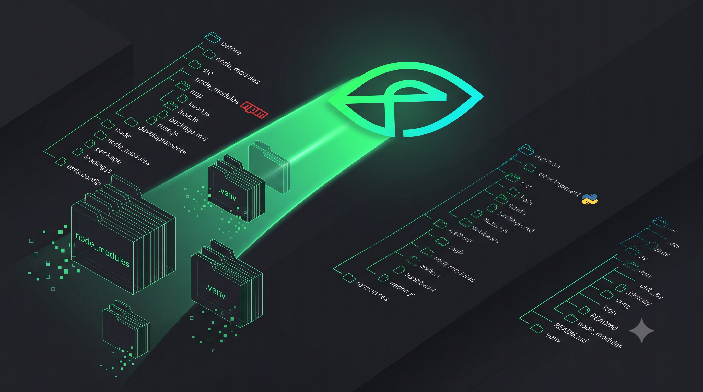
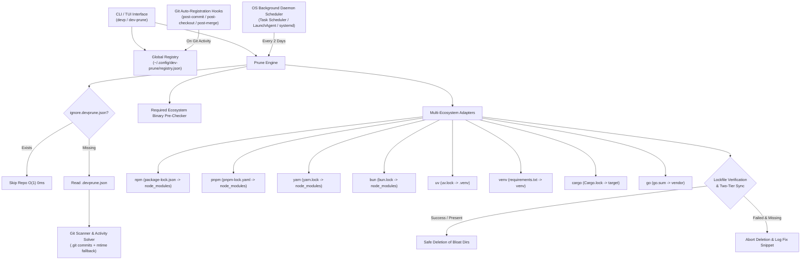

```text
 ___    _____ __     __    ____  ____  _   _ _   _ _____
|  _ \ | ____|\ \   / /   |  _ \|  _ \| | | | \ | | ____|
| | | ||  _|   \ \ / /    | |_) | |_) | | | |  \| |  _|
| |_| || |___   \ V /     |  __/|  _ <| |_| | |\  | |___
|____/ |_____|   \_/      |_|   |_| \_\\___/|_| \_|_____| v1.2.0
```

<div align="center">

# `dev-prune` &nbsp;·&nbsp; `devp` &nbsp;—&nbsp; by [VKrishna04](https://github.com/VKrishna04)

>**Reclaim the disk space your idle repositories are sitting on — without ever deleting**
**something a lockfile cannot put back.**

[](https://crates.io/crates/dev-prune) [](https://pypi.org/project/dev-prune/) [](LICENSE.md) [](https://www.rust-lang.org/) [](docs/RELEASES_AND_MANUAL_INSTALL.md)

[](https://github.com/Life-Experimentalist/dev-prune/actions/workflows/ci.yml) [](https://devprune.vkrishna04.me/)

<!-- The npm badge goes back in the row above the moment `dev-prune` is published to
     npm; until then shields.io renders it as a red "not found", which is worse than
     having no badge at all:
     [](https://www.npmjs.com/package/dev-prune) -->


[**Website**](https://devprune.vkrishna04.me/) · [**Documentation**](docs/README.md) · [**CLI reference**](docs/CLI_REFERENCE.md) · [**Safety invariants**](docs/SAFETY_INVARIANTS.md) · [**Changelog**](CHANGELOG.md)



</div>

---

`node_modules`, `.venv`, `target` and `vendor` are the largest directories on most
developers' machines, and the least valuable: every byte in them is described by a
lockfile that is already committed. A project you have not opened since March is holding
gigabytes hostage for a build you are not running.

`dev-prune` finds those directories across every Git repository you register, and deletes
them — but only after proving the exact command that puts them back would succeed. It is
a single Rust binary, installs its own background schedule, and answers to two names:
`dev-prune` and `devp`.

> [!IMPORTANT]
> **The rule the whole tool is built around:** nothing is deleted unless dev-prune has
> just verified, read-only, that its lockfile can rebuild it. There is no flag to skip
> that check. `--ignore-idle` lifts the idle-day wait and *nothing else*.

---

## Contents
<div align="center">

[Install](#install) · [60-second tour](#60-second-tour) · [What it looks like](#what-it-looks-like) · [Why it is safe](#why-it-is-safe) · [Features](#features) · [Commands](#commands) · [Ecosystems](#supported-ecosystems) · [Monorepos](#repositories-with-more-than-one-ecosystem) · [Configuration](#configuration) · [Automation](#background-automation) · [Comparison](#how-it-compares) · [Architecture](#architecture) · [Docs](#documentation)

</div>

---

## Install

### One-liner

Pick the line for the shell you are actually typing into. Pasting the first one into a
Command Prompt is the most common install failure there is — it answers
`'sh' is not recognized as an internal or external command`, because `sh` is a Unix shell
and Windows does not ship one.

**Linux, macOS, or a Unix shell on Windows** — Git Bash, MSYS2, Cygwin, WSL:

```bash
curl -fsSL https://devprune.vkrishna04.me/install.sh | sh
```

**Windows PowerShell** — the blue or black `PS>` prompt, and Windows Terminal's default:

```powershell
iwr -useb https://devprune.vkrishna04.me/install.ps1 | iex
```

**Windows Command Prompt** — the `C:\>` prompt, which has no `iwr` of its own:

```bat
powershell -NoProfile -ExecutionPolicy Bypass -Command "iwr -useb https://devprune.vkrishna04.me/install.ps1 | iex"
```

All three download the prebuilt binary for your platform, verify its published SHA-256,
put it on `PATH`, and run `dev-prune setup`. Pass `--no-auto-setup` / `-NoAutoSetup` to
skip that last step.

The Command Prompt form installs identically to the PowerShell one, but `cmd` cannot
inherit the `PATH` the installer sets in its own process, so `devp` resolves in the *next*
Command Prompt you open rather than the current one. PowerShell does not have that
problem.

### From a package manager

```bash
uv tool install dev-prune     # or: uvx dev-prune status
pipx install dev-prune
pip install dev-prune
cargo binstall dev-prune      # fetches the prebuilt release archive
cargo install dev-prune       # builds from source, needs Rust 1.88+
```

The PyPI packages **contain the binary** — there is no download step at install time,
so they work behind a registry mirror and offline. Everything but `cargo install` ships
a prebuilt executable.

crates.io stores source and nothing else, so `cargo install` has no binary to fetch and
always compiles. [`cargo binstall`](https://github.com/cargo-bins/cargo-binstall) is the
one that downloads: `Cargo.toml` tells it where this project's release archives live, so
it unpacks the same executable the installers use, with no toolchain involved.

The two Python entry points differ in where they land. `pip install` follows whichever
environment is active, so inside a virtualenv `devp` lives in that venv's `Scripts`/`bin`
and disappears with it; `pip install --user`, `pipx` and `uv tool install` are the
machine-wide forms. [Where each one puts the executables](docs/troubleshooting/INSTALLATION_ISSUES.md#6-uv-tool-install-put-the-executables-somewhere-unexpected).

### Direct download

Six checksummed archives per release on
[GitHub Releases](https://github.com/Life-Experimentalist/dev-prune/releases) — Windows,
macOS and Linux, x64 and arm64. The Linux binaries are statically linked against musl, so
one file per architecture runs on every distribution including Alpine.

Manual install and build-from-source:
[docs/RELEASES_AND_MANUAL_INSTALL.md](docs/RELEASES_AND_MANUAL_INSTALL.md).

### Let an AI assistant do it

Copy the prompt below and paste it to Claude Code, Cursor, GitHub Copilot, Windsurf, or
any terminal-capable agent — it installs, verifies, and registers your projects for you.
[More detail and per-tool notes.](docs/AI_SETUP_PROMPT.md)

````text
Install and set up `dev-prune` (binary name `devp`), a lockfile-safe workspace cleaner,
on this machine. Follow these steps exactly and do not improvise beyond them.

1. Detect the OS and run the matching official installer, nothing else:
   - macOS or Linux:
       curl -fsSL https://devprune.vkrishna04.me/install.sh | sh
   - Windows (PowerShell):
       iwr -useb https://devprune.vkrishna04.me/install.ps1 | iex
   - If a Rust toolchain is already present and you cannot reach the network, you may
     instead run:  cargo install dev-prune
   Do NOT download binaries from anywhere other than devprune.vkrishna04.me or the
   project's GitHub releases, and do NOT edit PATH, the registry, or any OS scheduler by
   hand — the installer and `devp setup` do all of that themselves.

2. Open a NEW terminal (so the updated PATH is in effect) and verify:
       devp --version
       devp doctor
   `devp doctor` must exit 0. If it prints warnings, read them out to me; do not try to
   "fix" the scheduler or hooks yourself — they are self-installing.

3. Ask me which project directories to keep clean, then register each one:
       devp init <path>
   Do not register directories I did not name. `devp init` only records a directory; it
   never deletes anything on its own.

4. Show me the result and stop:
       devp status

Notes you should rely on, not work around:
- Installation already registered a background pass (every 2 days) and, on Windows, a
  windowless task that never flashes a console window. You do not need to configure any
  of this.
- Nothing is ever deleted unless a lockfile can rebuild it, the repo has been idle past
  the threshold, and (interactively) I confirm. Run `devp run --dry-run` if I want a
  preview.
- To undo the whole thing later: `devp uninstall`.
````

Every install channel in detail: [docs/DISTRIBUTION.md](docs/DISTRIBUTION.md).

> [!TIP]
> **`devp` is a real executable, not a shell alias.** Installation puts a second binary
> next to `dev-prune`, so the short name works in cmd, PowerShell, bash, fish, an IDE
> terminal and a scheduled task alike — with no profile to re-source, and no chance of an
> upgrade leaving `devp` on the old version.

---

## 60-second tour

```bash
devp init ~/Projects        # register every Git repository under a tree
devp status                 # dashboard: what is tracked, what is reclaimable
devp run --dry-run          # what a pass would delete — changes nothing
devp run                    # do it, after confirming
devp restore --last-run     # put back exactly what that pass deleted
```

A few more worth knowing on day one:

```bash
devp stats                  # how much has been reclaimed so far, and by which repositories
devp caches                 # every package manager cache, sized. Deletes nothing
devp status --drift         # anything installed that the lockfiles don't record?
devp doctor .               # why is this repository not being pruned?
devp doctor --fix           # repair a broken integration — never a first-time install
devp -V                     # version, OS, architecture, config path, PATH audit
```

---

## What it looks like

<details open>
<summary><b><code>devp run --dry-run</code></b> — the plan, before anything is touched</summary>

```console
$ devp run --dry-run

dev-prune run (DRY RUN)
→ Scanning 4 registered repositories for prune candidates...

Prune Candidates & Space Savings Calculation
→   • ~/Code/acme-api → node_modules (412.7 MiB) [pnpm]
→   • ~/Code/acme-api → services/worker/.venv (188.2 MiB) [uv]
→   • ~/Code/render-farm → target (2.14 GiB) [cargo]
→   • ~/Code/edge-proxy → vendor (96.4 MiB) [go]

Summary (Dry Run)
→ Would free 2.82 GiB across 4 bloat directories.
```

</details>

<details>
<summary><b><code>devp status</code></b> — the dashboard, or a plain table with no TTY</summary>

```console
$ devp status

→ Global Config Location: ~/.config/dev-prune/registry.json
→ Background OS Daemon:   Installed
→ Background Git Hooks:   Installed
→ Global Command Timeout: 600s (10m)
→ Tracked Repositories:   4
→ Historical Space Saved: 6.31 GiB across 9 prune passes

dev-prune status

    #  Repository                           Status / Reason         Adapters      Bloat         Last Activity  Last Pruned
  ──────────────────────────────────────────────────────────────────────────────────────────────────────────────────────
    1  acme-api                             Candidate               pnpm+uv       600.9 MiB     2026-04-02     Never
    2  render-farm                          Candidate               cargo         2.14 GiB      2026-03-11     2026-01-08
    3  edge-proxy                           Candidate               go            96.4 MiB      2026-05-19     Never
    4  dashboard                            Active (not idle)       npm           314.0 MiB     2026-08-12     2026-06-30
  ──────────────────────────────────────────────────────────────────────────────────────────────────────────────────────
→ Total: 4 repos  |  3 candidates  |  3.13 GiB reclaimable
```

Keys: `↑`/`↓` move, `p` pre-selects every candidate, `Space` deselects the one you are
keeping, `Enter` prunes the rest, `i` toggles ignore for a repository, `q` exits.

</details>

<details>
<summary><b><code>devp caches</code></b> — where the rest of the disk went</summary>

```console
$ devp caches

Package manager caches

  uv cache                16.25 GiB  ~/.cache/uv
                                     clear: uv cache prune

  npm cache                8.97 GiB  ~/.npm
                                     clear: npm cache clean --force

  go build cache         371.75 MiB  ~/.cache/go-build
                                     clear: go clean -cache
                                     compiled build artifacts; clearing them means the next build is a cold one

  cargo registry sources 104.75 MiB  ~/.cargo/registry/src
                                     clear: rm -rf ~/.cargo/registry/src
                                     unpacked copies of the archives above; cargo re-extracts these offline

  …                                  (pip, bun, pnpm, go module cache, cargo registry cache)

  Total                   27.26 GiB  across 9 caches

→ Nothing above was deleted, and dev-prune never deletes any of it.
```

A cache lives outside every repository and is shared by all of them, so no single
lockfile can prove it recoverable — and it is what makes `devp restore` fast. `devp
caches` reports and prints the clear command; running it is your decision.

</details>

<details>
<summary><b><code>devp doctor .</code></b> — the one reason a repository is being skipped</summary>

```console
$ devp doctor .

dev-prune doctor (~/Code/dashboard)

Repository
  Git repository         ✓ yes
  Registered             ✓ yes, since 2026-04-11
  .devprune.json           parses; idle_days 20
  Opt-out                  none
  Activity                 2026-08-12 (0 days ago), threshold 20 — active
  Size floor               none — every recognised directory counts
  Scan depth               6 levels below the root

Projects

  . (npm)
      Lockfile           ✓ package-lock.json present
      Bloat              ✓ node_modules (314.0 MiB)

Verdict
  ✗ Would `devp run` prune this? No — active within the last 20 days.
    `devp --ignore-idle run ~/Code/dashboard` overrides exactly that check and nothing else.
```

It runs no package manager and repairs nothing, so it is safe to run twice — once to see
the problem, once to confirm the fix. Without a path it audits the installation instead:
binary location and `PATH`, the registry and every setting in it, the integrations, which
package managers are reachable, and the release-check state.


</details>

---

## Why it is safe

Seven invariants, enforced in code rather than by convention, none of which has a bypass
flag. Full detail and the reasoning behind each in
[docs/SAFETY_INVARIANTS.md](docs/SAFETY_INVARIANTS.md).

|   #   | Invariant                                                                               | What it prevents                                                                      |
| :---: | :-------------------------------------------------------------------------------------- | :------------------------------------------------------------------------------------ |
|   1   | **`.git` boundary** — only ever operates inside a directory holding a `.git` root       | Deleting a `node_modules` that belongs to no repository and has no lockfile behind it |
|   2   | **Lockfile pre-verification** — the ecosystem's own read-only check must pass first     | Deleting a tree whose lockfile has drifted, leaving a reinstall that fails            |
|   3   | **Hybrid activity solver** — the later of the last commit and the newest source `mtime` | Pruning a project with a week of uncommitted work in it                               |
|   4   | **Atomic state writes** — write to a temp file, then rename                             | A registry corrupted by a crash or a power cut mid-write                              |
|   5   | **0ms ignore fast path** — `ignore.devprune.json` short-circuits before any parsing     | A repository you opted out of being scanned at all                                    |
|   6   | **Symlink and junction refusal**                                                        | Following a link out of the repository and deleting storage it does not own           |
|   7   | **Nested repository boundary**                                                          | A submodule being deleted as part of its parent instead of on its own terms           |

Verification is **read-only by default**: `npm ci --dry-run`, `uv lock --locked`, `cargo
metadata --locked`, `go mod download`. Each resolves the dependency graph against the
lockfile on disk and *fails* when the two disagree, instead of quietly rewriting the
lockfile and continuing. The writing form runs in exactly two cases — when no lockfile
exists at all, and when you have asked with `devp config set allow_manifest_rewrite true`
— because a pass can be started by the OS scheduler while you are away, and a background
process that leaves a dirty working tree is a surprise.

---

## Features

|                                               |                                                                                                                                                                                                                                                 |
| :-------------------------------------------- | :---------------------------------------------------------------------------------------------------------------------------------------------------------------------------------------------------------------------------------------------- |
| 🔒 **Lockfile-gated deletion**                 | Nothing goes without a passing read-only verification against `package-lock.json`, `pnpm-lock.yaml`, `yarn.lock`, `bun.lock`, `uv.lock`, `requirements.txt`, `Cargo.lock` or `go.sum`                                                           |
| 🧩 **Any number of ecosystems per repository** | uv, npm and cargo in one root, or spread across `frontend/`, `services/api/` and `tools/cli/` — each discovered, verified and pruned on its own terms                                                                                           |
| ↩️ **One-command restore**                     | `devp restore .` reinstalls a tree; `devp restore --last-run` puts back exactly what the most recent pass deleted, across every repository it touched                                                                                           |
| 🕒 **Activity-aware**                          | Combines `git log` timestamps with source-file `mtime`, so uncommitted work protects a repository just as a commit does                                                                                                                         |
| 📊 **Cache report**                            | `devp caches` sizes every package manager cache and store on the machine — npm to cargo to Maven, Gradle, NuGet, vcpkg and Conan — and prints the command that clears each. Read-only, always                                                   |
| 🩺 **`devp doctor`**                           | One read-only pass that ends by naming the *single* reason a repository would or would not be pruned. Runs no package manager, repairs nothing, safe to run twice. `devp doctor --fix` then mends what it found — installed-but-broken only     |
| 🤖 **Self-installing automation**              | OS-native scheduler (Task Scheduler, LaunchAgent, systemd user timer) and non-blocking Git hooks, installed at install time and restored after an upgrade. `auto_setup`, `auto_hooks`, `auto_daemon` or `DEV_PRUNE_NO_AUTO_SETUP=1` turn it off |
| ⚡ **0ms opt-out**                             | An `ignore.devprune.json` in a repository root is honoured by file presence alone — no read, no parse                                                                                                                                           |
| 🔌 **`--json` on every reporting command**     | `run`, `status`, `stats` and `caches` each emit one versioned document on stdout, diagnostics on stderr. Built for scripts and agents                                                                                                           |
| 🧠 **AI agent skill**                          | A token-lean `SKILL.md` embedded in the binary; `devp skill` exports it and prints onboarding prompts for Claude Code, Gemini Antigravity, Cursor, Windsurf, Copilot and OpenClaw                                                               |
| 🧰 **Editor extension**                        | Validates `.devprune.json` as you type and shows the workspace's reclaimable size in the status bar. `devp setup` offers to install it — once, only at a terminal — into VS Code, VSCodium, Cursor, Windsurf, Positron or Kiro, each from its own registry with the release `.vsix` as fallback. [docs/IDE_INTEGRATION.md](docs/IDE_INTEGRATION.md)  |
| 🖼️ **File manager icons**                      | `devp icon` registers `*.devprune.json` with the OS file manager — a real `shared-mime-info` type plus hicolor icons on Linux, a folder icon on Windows. It never edits your editor settings, `PATH` or shell startup files                     |
| 🚫 **No telemetry**                            | One optional unauthenticated `GET` to GitHub's public releases endpoint, at most weekly, no body and no identifier. Nothing else leaves the machine                                                                                             |

---

## Commands

| Command                | Also                                                                | What it does                                                                                                                                                                                    |
| :--------------------- | :------------------------------------------------------------------ | :---------------------------------------------------------------------------------------------------------------------------------------------------------------------------------------------- |
| `devp init [PATHS]`    | `scan`, `onboard`                                                   | Crawls directory trees for Git repositories and registers them, then runs the `setup` integration pass                                                                                          |
| `devp link [PATH]`     |                                                                     | Registers one repository                                                                                                                                                                        |
| `devp unlink [PATH]`   | `--missing`                                                         | Unregisters one; `--missing` drops every entry whose directory is gone, in one pass                                                                                                             |
| `devp undo`            |                                                                     | Reverts the most recent `init` or `link`                                                                                                                                                        |
| `devp run [PATH]`      | `--dry-run`, `--only`, `--skip`, `--except`, `--min-size`, `--json` | Prunes every registered repository, or one target                                                                                                                                               |
| `devp status`          | `--top N`, `--drift`, `--json`                                      | Interactive dashboard; a plain table when there is no TTY. `--top N` shows only the N biggest repositories; `--drift` lists every environment holding packages its lockfile never recorded      |
| `devp stats`           | `--json`                                                            | What has already been reclaimed: lifetime total, prune passes, the last pass, and the biggest contributors                                                                                      |
| `devp completions`     | `bash`, `zsh`, `fish`, `powershell`, `elvish`                       | Prints a shell completion script to stdout, generated from the same argument definitions the binary parses with                                                                                 |
| `devp caches`          | `--json`                                                            | Sizes every package manager cache on the machine and prints the command that clears each. **Deletes nothing**                                                                                   |
| `devp restore [PATH]`  | `--last-run`                                                        | Reinstalls dependencies for every project in a tree; `--last-run` undoes the last prune pass                                                                                                    |
| `devp doctor [PATH]`   | `--fix`                                                             | Diagnoses the installation, or one repository — ending with the single reason a pass would or would not touch it. `--fix` repairs what the checks found; it never performs a first-time install |
| `devp config [ACTION]` | `get`, `set`, `show`, `wizard`, `project`, `daemon`, `hook`, `icon` | Global settings, per-repository `.devprune.json`, scheduler, Git hooks, file manager icons                                                                                                      |
| `devp setup`           | `--status`                                                          | Installs any missing integration; `--status` only reports                                                                                                                                       |
| `devp update`          | `--offline`, `--install`                                            | Prints the installed version, checks GitHub for a newer release, shows the upgrade command for your install channel; `--install` runs that upgrade through the channel that owns this copy      |
| `devp skill`           | `--agent <editor>`                                                  | Exports `SKILL.md` and prints AI agent onboarding prompts; `--agent` writes per-repository rules for Cursor, Windsurf, Antigravity, Cline, Copilot or `AGENTS.md`                                |
| `devp man`             | `--dir <dir>`                                                       | The manual as man pages, generated from the same argument definitions `--help` prints; alone it emits `devp(1)` to stdout, `--dir` writes the full set                                          |
| `devp uninstall`       | `--deep`                                                            | Removes the scheduler, hooks, both binaries and every other installed copy it can find on the machine; `--deep` also clears configuration                                                       |
| `devp -V`              |                                                                     | Version plus an environment audit: OS, architecture, config path, PATH activation                                                                                                               |

`devp hook`, `devp daemon` and `devp icon` are shorthands for the `config` subcommands of
the same name, and `install` / `uninstall` / `on` / `off` work wherever `enable` /
`disable` do — so `devp hook install` and `devp config hook enable` are the same command.
A misspelled action is rejected rather than quietly reported as status.

`--help` is the manual: every command and every `config` subcommand carries long-form
help with worked examples — `devp run --help`, `devp config hook --help`, and so on at
every level — while `-h` keeps the short version.

Exit codes are a contract: `0` success, `1` failure, `2` unusable arguments. Full flag
list, every setting and the `--json` schema: **[docs/CLI_REFERENCE.md](docs/CLI_REFERENCE.md)**.

---

## Supported ecosystems

Adapters detect the project, verify the lockfile, and own the bloat directories:

| Ecosystem         | Detected by                                              | Bloat                                   | Verification (read-only)                                                                                          | Restore                                                   |
| :---------------- | :------------------------------------------------------- | :-------------------------------------- | :---------------------------------------------------------------------------------------------------------------- | :-------------------------------------------------------- |
| **npm**           | `package-lock.json`                                      | `node_modules`                          | `npm ci --dry-run --ignore-scripts`                                                                               | `npm ci`                                                  |
| **pnpm**          | `pnpm-lock.yaml`                                         | `node_modules`                          | `pnpm install --lockfile-only --frozen-lockfile`                                                                  | `pnpm install --frozen-lockfile`                          |
| **Yarn**          | `yarn.lock`                                              | `node_modules`                          | `yarn install --immutable --mode update-lockfile` (Berry); on Classic an existing `yarn.lock` is itself the proof | `yarn install --immutable`                                |
| **Bun**           | `bun.lockb`, `bun.lock`                                  | `node_modules`                          | `bun install --frozen-lockfile --dry-run --ignore-scripts`                                                        | `bun install --frozen-lockfile`                           |
| **uv** (Python)   | `uv.lock`, `[tool.uv]` in `pyproject.toml`               | `.venv`                                 | `uv lock --locked`                                                                                                | `uv sync`                                                 |
| **Poetry** (Python) | `poetry.lock`, `[tool.poetry]` in `pyproject.toml`     | `.venv`                                 | `poetry check --lock`, plus no installed package the lockfile never recorded                                      | `poetry install`                                          |
| **venv** (Python) | `requirements.txt` + a directory containing `pyvenv.cfg` | every directory containing `pyvenv.cfg` | `requirements.txt` must exist and list at least one package                                                       | `python -m venv .venv && pip install -r requirements.txt` |
| **Cargo** (Rust)  | `Cargo.toml`                                             | `target`                                | `cargo metadata --locked`                                                                                         | *(rebuilt by the next `cargo build`)*                     |
| **Go**            | `go.mod`                                                 | `vendor`                                | `go mod download`                                                                                                 | `go mod vendor`                                           |
| **Gradle** *(opt-in)* | `build.gradle[.kts]`, `settings.gradle[.kts]`        | `build`, `.gradle`                      | manifest present and readable — the rebuild-from-source proof                                                     | *(rebuilt by the next `./gradlew build`)*                 |
| **Maven** *(opt-in)*  | `pom.xml`                                            | `target`                                | `pom.xml` parses as a Maven manifest                                                                              | *(rebuilt by the next `mvn package`)*                     |

A required binary that is missing is a reason to skip, never a reason to delete: if `npm`
is not on `PATH`, the `node_modules` it owns is left exactly where it is.

The two build tools ship **disabled**, because a build tree is regenerated by
recompiling, not downloading — it costs more to get back. `devp config set
enable_gradle true` / `enable_maven true` switches them on, and their candidates wait
for `build_idle_days` (60 by default), applied as the *maximum* of it and `idle_days`
— the build-tool gate only ever makes pruning later, never earlier.

> [!TIP]
> Adding an ecosystem is documented end to end in
> [docs/ADDING_ADAPTERS.md](docs/ADDING_ADAPTERS.md) — trait, registration, tests.

### Repositories with more than one ecosystem

A repository is not assumed to be one project. dev-prune walks the root and up to
`scan_depth` levels below it — six by default, `devp config set scan_depth N` to change
it, or `"scan_depth"` in a repository's `.devprune.json` for just that tree. Every
directory a package manager recognises is verified and pruned on its own terms. All three
of these work:

```
monorepo/                          monorepo/                     monorepo/
├── package-lock.json              ├── frontend/                 ├── Cargo.toml
├── uv.lock                        │   └── pnpm-lock.yaml        ├── web/
└── Cargo.toml                     ├── services/api/             │   └── package-lock.json
                                   │   └── uv.lock               └── scripts/
   three managers, one root        └── tools/cli/                    └── requirements.txt
                                       └── Cargo.toml
                                                                  root + nested, mixed
                                    one manager per subtree
```

Results are reported by repository-relative path, so a monorepo reads unambiguously:

```
  • MyMonorepo → frontend/node_modules (412.7 MiB) [pnpm]
  • MyMonorepo → services/api/.venv (188.2 MiB) [uv]
  • MyMonorepo → tools/cli/target (1.4 GiB) [cargo]
```

The walk never descends into `node_modules`, `target`, `vendor`, virtual environments,
hidden directories, or nested repositories — a submodule is pruned as itself, never as
part of its parent.

When npm, pnpm, yarn and bun all claim the same `node_modules`, exactly one is chosen,
strongest signal first:

1. the `packageManager` field in `package.json`,
2. the bookkeeping files inside the installed tree (`node_modules/.pnpm`,
   `.yarn-state.yml`, `.package-lock.json`) — whoever built what is actually on disk,
3. the most recently written lockfile.

For Python, uv or Poetry takes the environment whenever it recognises the project —
between the two, whichever one's lockfile is actually on disk wins — and the
`requirements.txt` adapter handles everything else.

---

## Configuration

Global settings live in `%APPDATA%\dev-prune` (Windows),
`~/Library/Application Support/dev-prune` (macOS) and `$XDG_CONFIG_HOME/dev-prune`
(Linux). `devp config wizard` walks through every one of them and runs itself once on a
first install, so the defaults are something you agreed to.

| Key                                                        |  Default  | Meaning                                                                             |
| :--------------------------------------------------------- | :-------: | :---------------------------------------------------------------------------------- |
| `idle_days`                                                |   `15`    | How long a repository must be untouched to become a candidate                       |
| `min_size_mb`                                              |    `0`    | Smallest bloat directory worth deleting; `0` disables the floor                     |
| `scan_depth`                                               |    `6`    | Levels below a repository root that discovery descends                              |
| `require_confirmation`                                     |  `true`   | Whether a pass asks before deleting                                                 |
| `allow_manifest_rewrite`                                   |  `false`  | Whether verification may *repair* a drifted lockfile instead of refusing            |
| `command_timeout_secs`                                     |   `600`   | Ceiling on any one package manager command                                          |
| `auto_setup` · `auto_daemon` · `auto_hooks`                |  `true`   | Whether the integration pass may run unattended, and what it may install            |
| `auto_hooks_chain`                                         |  `false`  | Whether it may take a `core.hooksPath` another tool holds, forwarding every hook on |
| `check_interval_days`                                      |    `2`    | How often the OS scheduler runs a pass                                              |
| `update_check`                                             |  `true`   | Whether the periodic release check runs                                             |
| `update_check_interval_days` · `update_check_timeout_secs` | `7` · `5` | Minimum gap between checks, and how long one may hang                               |

Three of them — `idle_days` (as `override_idle_days`), `min_size_mb` and `scan_depth` —
also take a per-repository form in that project's `.devprune.json`, where they win for
that tree only. The rest are deliberately global: a project can commit its
`.devprune.json`, and a repository you have never read should not be able to grant itself
permission to have its manifests rewritten during an unattended pass.

An out-of-range value is rejected with the range in the message rather than silently
clamped. `scan_depth` included: `config set` accepts `1`–`32` and refuses anything else
outright — the clamp to that range survives only as the backstop for a hand-edited
config file.

---

## Background automation

Installation registers an OS-native scheduler — Windows Task Scheduler, a macOS
LaunchAgent, or a systemd user timer — that runs a pass every `check_interval_days`, plus
non-blocking `post-commit`, `post-checkout` and `post-merge` Git hooks that register new
repositories as you visit them. Both are reinstated after an upgrade if anything went
missing.

```bash
devp setup --status              # what is installed, what is not, and why
devp config set auto_setup false # stop the unattended pass entirely
devp uninstall                   # remove the scheduler, hooks and the devp link
```

Git allows exactly one global `core.hooksPath`, so a tool holding it shuts every other one
out machine-wide. `devp hook install --chain` takes the slot and forwards each hook on to
the tool it displaced — husky, pre-commit and lefthook keep firing, in order, with their
own exit codes. It is opt-in, because rewiring another tool's Git configuration unasked is
not something an install should do.

Full decision flow: [docs/BACKGROUND_AUTOMATION.md](docs/BACKGROUND_AUTOMATION.md).

---

## How it compares

|                                           |         `dev-prune`         | `npkill` | `cargo-clean-all` | `pyclean` |   `git clean`   | `dust` / `ncdu` | BleachBit |
| :---------------------------------------- | :-------------------------: | :------: | :---------------: | :-------: | :-------------: | :-------------: | :-------: |
| Ecosystems                                | **JS/TS, Python, Rust, Go** |   Node   |       Rust        |  Python   | untracked files |        —        | OS caches |
| Many projects per repository              |            **✓**            |    ✗     |         ✗         |     ✗     |       n/a       |       n/a       |     ✗     |
| `.git` boundary enforced                  |            **✓**            |    ✗     |         ✓         |     ✗     |        ✓        |        ✗        |     ✗     |
| Lockfile verified before deleting         |            **✓**            |    ✗     |         ✗         |     ✗     |        ✗        |        ✗        |     ✗     |
| Commit log **and** `mtime` activity check |            **✓**            |    ✗     |   `mtime` only    |     ✗     |        ✗        |        ✗        |     ✗     |
| One-command restore                       |            **✓**            |    ✗     |         ✗         |     ✗     |        ✗        |        ✗        |     ✗     |
| Undo the last pass                        |            **✓**            |    ✗     |         ✗         |     ✗     |        ✗        |        ✗        |     ✗     |
| Background scheduler                      |            **✓**            |    ✗     |         ✗         |     ✗     |        ✗        |        ✗        |     ✗     |
| Git hook auto-registration                |            **✓**            |    ✗     |         ✗         |     ✗     |        ✗        |        ✗        |     ✗     |
| Per-repository config + 0ms opt-out       |            **✓**            |    ✗     |         ✗         |     ✗     |        ✗        |        ✗        |     ✗     |
| Machine-readable `--json`                 |            **✓**            |    ✗     |         ✗         |     ✗     |        ✗        |     partial     |     ✗     |
| AI agent skill                            |            **✓**            |    ✗     |         ✗         |     ✗     |        ✗        |        ✗        |     ✗     |
| Runtime required                          |  **none** (static binary)   | Node.js  |       none        |  Python   |      none       |      none       |  Python   |

Longer analysis: [docs/MARKET_ANALYSIS.md](docs/MARKET_ANALYSIS.md).

---

## Architecture



- **Registry** — Serde-backed, written atomically, holding registered paths and settings.
- **Engine** — coordinates activity discovery, verification and space calculation.
- **FastIgnore** — presence check for `ignore.devprune.json`; no read, no parse.
- **GitScanner** — `git log` timestamps plus source-file `mtime`.
- **PreCheck** — confirms the package manager binaries a pass will actually need.
- **Adapters** — one per ecosystem, each owning detection, verification and restore.
- **LockfileCheck** — the gate; failure aborts the deletion and prints the exact fix command.
- **Daemon / GitHooks** — the unattended pass, and registration as you work.

Deeper: [docs/ARCHITECTURE.md](docs/ARCHITECTURE.md) ·
[HLD](docs/architecture/HLD.md) · [LLD](docs/architecture/LLD.md).

---

## Documentation

|                                                                                                          |                                                               |
| :------------------------------------------------------------------------------------------------------- | :------------------------------------------------------------ |
| [Documentation hub](docs/README.md)                                                                      | Index of everything below                                     |
| [CLI reference](docs/CLI_REFERENCE.md)                                                                   | Every command, flag, setting, exit code and `--json` document |
| [Safety invariants](docs/SAFETY_INVARIANTS.md)                                                           | The seven guarantees, and why each exists                     |
| [Architecture](docs/ARCHITECTURE.md) · [HLD](docs/architecture/HLD.md) · [LLD](docs/architecture/LLD.md) | How it is built                                               |
| [Background automation](docs/BACKGROUND_AUTOMATION.md)                                                   | Schedulers, hooks, chaining, and turning it all off           |
| [IDE & editor integration](docs/IDE_INTEGRATION.md)                                                      | The extension, schema IntelliSense, and every editor it works in |
| [Adding an adapter](docs/ADDING_ADAPTERS.md)                                                             | End-to-end tutorial for a new ecosystem                       |
| [Releases & manual install](docs/RELEASES_AND_MANUAL_INSTALL.md) · [Distribution](docs/DISTRIBUTION.md)  | Every install channel, and building from source               |
| [Troubleshooting](docs/troubleshooting/README.md)                                                        | Symptom-first, with the fix for each                          |
| [Privacy](docs/PRIVACY.md)                                                                               | The one network request, in full                              |
| [Market analysis](docs/MARKET_ANALYSIS.md)                                                               | Where this sits among the alternatives                        |
| [Contributing](CONTRIBUTING.md) · [Security policy](SECURITY.md) · [Changelog](CHANGELOG.md)             |                                                               |

---

## License & privacy

Copyright 2026 VKrishna04. Licensed under the Apache License, Version 2.0 — see
[LICENSE.md](LICENSE.md). Every source file carries an
[SPDX](https://spdx.dev/) identifier, so automated licence scanners see the same
answer the file header does.

> [!IMPORTANT]
> **No analytics, no diagnostics, no usage data** — none collected, none sent. Your
> workspace structure, directory paths and repository names never leave the machine.
>
> `dev-prune` makes exactly one network request: an unauthenticated `GET` to GitHub's
> public releases endpoint, to tell you when a newer version exists. It has no body,
> carries no identifier, and runs at most once a week. Turn it off with `devp config set
> update_check false`. Full detail in [docs/PRIVACY.md](docs/PRIVACY.md).
