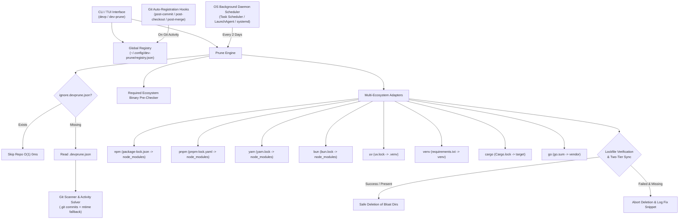

# dev-prune (`devp`)

```
 ___    _____ __     __    ____  ____  _   _ _   _ _____ 
|  _ \ | ____|\ \   / /   |  _ \|  _ \| | | | \ | | ____|
| | | ||  _|   \ \ / /    | |_) | |_) | | | |  \| |  _|  
| |_| || |___   \ V /     |  __/|  _ <| |_| | |\  | |___ 
|____/ |_____|   \_/      |_|   |_| \_\\___/|_| \_|_____| v1.0.0
```

[](https://github.com/Life-Experimentalist/dev-prune/actions/workflows/ci.yml) | [](https://devprune.vkrishna04.me/) | [](LICENSE.md) | [](https://www.rust-lang.org/)

<p align="center">
  
</p>

**Universal, Lockfile-Safe Workspace Maintenance CLI & Background Dependency Cleaner in Rust**

`dev-prune` (and its interchangeable binary alias **`devp`**) is a cross-platform CLI application that safely reclaims tens to hundreds of gigabytes of disk space by removing heavy build artifacts (`node_modules`, `.venv`, `venv`, `target`, `vendor`) from inactive Git repositories.

🌐 **Website & Documentation**: [devprune.vkrishna04.me](https://devprune.vkrishna04.me/) | 📚 **[Documentation Index Hub](docs/README.md)**

---

## 🌟 Core Capabilities & Features

> [!NOTE]
> `dev-prune` is engineered for zero-friction developer productivity with strict safety guarantees.

- 🔒 **Two-Tier Lockfile Safety Guarantee**: Verifies lockfile integrity (`package-lock.json`, `pnpm-lock.yaml`, `uv.lock`, `Cargo.lock`, `go.sum`, etc.) before deleting any bloat directory. If a lockfile exists on disk, pruning proceeds safely because dependencies can be restored anytime using `devp restore`.
- ⚡ **0ms Fast-Path `ignore.devprune.json` Check**: If `ignore.devprune.json` exists in a repository root, `dev-prune` skips scanning with **0ms O(1) latency** without reading or parsing JSON contents.
- 🎯 **Targeted Single-Project Execution**: Run `devp run .` or `devp run ~/Code/MyProject` for immediate targeted pruning of a specific workspace.
- ⏱️ **10-Minute Configurable Timeout Guard**: Lockfile sync commands execute under a default 10-minute (600s) timeout guard, configurable via `devp config set command_timeout_secs 1200`.
- 🛠️ **Shell-Specific Troubleshooting Snippets**: Generates exact copy-paste fix command snippets (PowerShell on Windows, Bash on Linux/macOS) upon lockfile sync errors.
- 🛡️ **Strict `.git` Boundary & CWD Independence**: ONLY operates inside folders containing a valid `.git` root. Runs deterministically regardless of invocation Current Working Directory (CWD).
- 🕒 **Hybrid Activity Solver**: Combines `git log` commit timestamps with source file `mtime` modification timestamps to protect uncommitted local work.
- 🔄 **1-Command Dependency Restoration**: Re-install missing dependencies anytime using `devp restore`.
- 🧩 **Any Number of Ecosystems per Repository**: uv, npm and cargo in one root, or spread across `frontend/`, `services/api/` and `tools/cli/` — every project is discovered, verified and pruned on its own terms.
- 🤖 **Self-Installing Background Automation**: OS-native schedulers (Windows Task Scheduler, macOS LaunchAgent, Linux systemd user timers) and non-blocking Git hooks (`post-commit`, `post-checkout`, `post-merge`) are installed for you at install time, and restored after an upgrade if anything went missing. `devp setup` runs the same pass by hand; `auto_setup`, `auto_hooks`, `auto_daemon` or `DEV_PRUNE_NO_AUTO_SETUP=1` turn it off.
- 🖼️ **File Manager Icon Registration**: `devp icon` registers `*.devprune.json` with the OS file manager — a real `shared-mime-info` type plus hicolor icons on Linux, a `desktop.ini` folder icon on Windows (Explorer resolves icons from the last extension only, so claiming `.devprune.json` would mean claiming every `.json` on the machine). Editors get a snippet to paste; nothing edits an editor's settings for you.
- 🤖 **Native AI Agent Skill Integration**: Includes a token-lean AI Skill definition enabling AI pair programming agents (Gemini Antigravity, Claude Code, Cursor, Windsurf, Copilot, OpenClaw) to safely inspect and manage workspace bloat natively.

---

## 🚀 Installation

### One-liner

```bash
curl -fsSL https://devprune.vkrishna04.me/install.sh | sh
```

```powershell
iwr -useb https://devprune.vkrishna04.me/install.ps1 | iex
```

Downloads the prebuilt binary for your platform, verifies its published SHA-256, puts it
on `PATH`, and runs `dev-prune setup`. Pass `--no-auto-setup` / `-NoAutoSetup` to skip
that last step.

### From a package manager

```bash
npx dev-prune status          # no install at all
npm install -g dev-prune
uv tool install dev-prune     # or: uvx dev-prune status
pipx install dev-prune
pip install dev-prune
cargo install dev-prune       # builds from source, needs Rust 1.85+
```

The npm and PyPI packages **contain the binary** — there is no `postinstall` download
step, so they work under `npm ci --ignore-scripts`, behind a registry mirror, and
offline. Everything but `cargo install` ships a prebuilt executable.

### Direct download

Six checksummed archives per release on
[GitHub Releases](https://github.com/Life-Experimentalist/dev-prune/releases) — Windows,
macOS and Linux, x64 and arm64. The Linux binaries are statically linked against musl,
so one file per architecture runs on every distribution including Alpine.

Step-by-step manual install and build-from-source:
**[docs/RELEASES_AND_MANUAL_INSTALL.md](docs/RELEASES_AND_MANUAL_INSTALL.md)**.
Every channel in detail: **[docs/DISTRIBUTION.md](docs/DISTRIBUTION.md)**.

---

## 🛠️ Usage Quick Start

```bash
# 1. Crawl & register Git repositories in workspace
devp init ~/Projects

# 2. View tracked repos and reclaimable space dashboard (Press [i] to toggle ignore, [p] to prune)
devp status

# 3. Simulate pruning pass (Dry Run — 100% safe inspection)
devp run --dry-run

# 4. Execute targeted prune pass for a single project
devp run .

# 5. Restore dependencies for a project
devp restore ~/Projects/my-app

# 6. Put back exactly what the last prune pass deleted
devp restore --last-run

# 7. Find out why a repository is or is not being pruned
devp doctor .

# 8. Check system environment & PATH audit
devp -V
```

---

## 💻 Subcommand Matrix

| Command | Shorthand / Alias | Description |
| :--- | :--- | :--- |
| `devp init [PATHS]` | `scan`, `onboard` | Crawls directories for Git repos and registers them, then runs the same integration pass as `devp setup` |
| `devp link [PATH]` | | Registers a single Git repository directory for tracking |
| `devp unlink [PATH]` | `--missing` | Unregisters a repository from the `dev-prune` registry; `--missing` drops every entry whose directory no longer exists |
| `devp undo` | | Reverts the most recent `init` or `link` registration action |
| `devp run [PATH]` | | Runs a prune pass across registered repos or a specific target path |
| `devp status` | | Opens the interactive Ratatui dashboard (shortcuts: `status daemon`, `status hook`) |
| `devp config [ACTION]` | | Manages global settings (`wizard`, `show`, `get`, `set`), per-repo `.devprune.json`, daemons, hooks, & file-manager icons |
| `devp restore [PATH]` | `--last-run` | Re-installs missing dependencies using project lockfiles; `--last-run` puts back exactly what the last prune pass deleted |
| `devp update` | `--offline` | Prints the installed version, checks GitHub for a newer release, and shows how to upgrade |
| `devp setup [--status]` | | Installs any missing integration (the `devp` second binary, `SKILL.md`, git hooks, scheduler); `--status` only reports |
| `devp doctor [PATH]` | | Diagnoses the installation, or one repository — ending with the single reason a prune pass would or would not touch it |
| `devp skill` | | Exports `SKILL.md` and displays AI Agent onboarding prompts |
| `devp uninstall [--deep]` | | Removes background daemon schedulers, Git hooks, and optional config wipe |

`devp hook`, `devp daemon` and `devp icon` are shorthands for the `config` subcommands of
the same name, and `install` / `uninstall` / `on` / `off` work wherever `enable` /
`disable` do — so `devp hook install` and `devp config hook enable` are the same command.
A misspelled action is rejected rather than quietly reported as status.

---

## 📦 Supported Ecosystem Adapters

Adapters detect the project type, verify the lockfile, and own the bloat directories:

| Ecosystem | Detected By | Bloat Directories | Lockfile Verification (read-only) | Dependency Restore |
| :--- | :--- | :--- | :--- | :--- |
| **npm** | `package-lock.json` | `node_modules` | `npm ci --dry-run --ignore-scripts` | `npm ci` |
| **pnpm** | `pnpm-lock.yaml` | `node_modules` | `pnpm install --lockfile-only --frozen-lockfile` | `pnpm install --frozen-lockfile` |
| **Yarn** | `yarn.lock` | `node_modules` | `yarn install --immutable --mode update-lockfile` (Berry); on Classic, an existing `yarn.lock` is itself the proof | `yarn install --immutable` |
| **Bun** | `bun.lockb`, `bun.lock` | `node_modules` | `bun install --frozen-lockfile --dry-run --ignore-scripts` | `bun install --frozen-lockfile` |
| **uv (Python)** | `uv.lock`, `[tool.uv]` in `pyproject.toml` | `.venv` | `uv lock --locked` | `uv sync` |
| **venv (Python)** | `requirements.txt` + any directory containing `pyvenv.cfg` | every directory containing `pyvenv.cfg` | `requirements.txt` must exist and list at least one package | `python -m venv .venv && pip install -r requirements.txt` |
| **Cargo (Rust)** | `Cargo.toml` | `target` | `cargo metadata --locked` | *(rebuilt by the next `cargo build`)* |
| **Go** | `go.mod` | `vendor` | `go mod download` | `go mod vendor` |

Every one of those verification commands is **read-only**. That column is the whole
safety story in one place: each one resolves the project's dependency graph against the
lockfile on disk and *fails* when the two have drifted apart, rather than fixing the
lockfile and carrying on. The writing form of the same command — `npm install
--package-lock-only`, `pnpm install --lockfile-only`, `uv lock`, `cargo
generate-lockfile`, `go mod tidy` — runs in exactly two situations: when there is no
lockfile at all, so there is nothing to preserve and one has to exist before `restore`
can work; and when you have asked for it:

```bash
devp config set allow_manifest_rewrite true
```

That is an opt-in, not a default, because a prune pass can be started by the scheduler
while you are not at the keyboard, and a background process that leaves you with a dirty
working tree is a surprise — whether it edited `Cargo.lock`, `go.sum` or
`package-lock.json`. It is global on purpose: nothing stops a project from committing its
`.devprune.json`, so a per-repository form would let a repository you have never read
grant itself permission to have its manifests rewritten.

### Repositories with more than one ecosystem

A repository is not assumed to be one project. dev-prune walks the repository root and up
to `scan_depth` levels below it — six by default, `devp config set scan_depth N` to change
it, or `"scan_depth"` in a repository's `.devprune.json` for just that tree. Every
directory that a package manager recognises is verified and pruned on its own terms. All
of these work:

```
monorepo/                          monorepo/                     monorepo/
├── package-lock.json              ├── frontend/                 ├── Cargo.toml
├── uv.lock                        │   └── pnpm-lock.yaml        ├── web/
└── Cargo.toml                     ├── services/api/             │   └── package-lock.json
                                   │   └── uv.lock               └── scripts/
   three managers, one root        └── tools/cli/                    └── requirements.txt
                                       └── Cargo.toml
                                                                  root + nested, mixed
                                    one manager per subtree
```

The walk never descends into `node_modules`, `target`, `vendor`, virtual environments,
hidden directories, or nested repositories — a submodule is pruned as itself, never as
part of its parent.

When npm, pnpm, yarn and bun all claim the same `node_modules`, exactly one is chosen,
strongest signal first:

1. the `packageManager` field in `package.json`,
2. the bookkeeping files inside the installed tree (`node_modules/.pnpm`,
   `.yarn-state.yml`, `.package-lock.json`) — whoever built what is on disk,
3. the most recently written lockfile.

For Python, uv takes the environment whenever it recognises the project; the
`requirements.txt` adapter handles everything else.

> [!TIP]
> **Adding New Ecosystems**: `dev-prune` is designed for simple extension. See [How to Add a New Package Manager Adapter (`docs/ADDING_ADAPTERS.md`)](docs/ADDING_ADAPTERS.md) for a step-by-step tutorial.

---

## 📊 Competitor Comparison Matrix

| Feature / Capability | `dev-prune` (`devp`) | `npkill` | `cargo-clean-all` | `pyclean` / `pyprune` | `git clean` | `dust` / `ncdu` | `BleachBit` |
| :--- | :---: | :---: | :---: | :---: | :---: | :---: | :---: |
| **Language Runtime** | **Rust (1.85+)** | Node.js | Rust | Python | C / C++ | Rust / C | Python / C |
| **Multi-Ecosystem Coverage** | **✓ (JS/TS, Python, Rust, Go)** | ✗ (Node only) | ✗ (Rust only) | ✗ (Python only) | ✗ (All untracked) | ✗ (Generic FS) | ✗ (OS Caches) |
| **Many Projects per Repository** | **✓ (monorepo-aware discovery)** | ✗ | ✗ | ✗ | n/a | n/a | ✗ |
| **Git Repository Safety Boundary** | **✓ (`.git` enforced)** | ✗ | ✓ | ✗ | ✓ | ✗ | ✗ |
| **Pre-Deletion Lockfile Verification** | **✓ (Two-tier sync & verify)** | ✗ | ✗ | ✗ | ✗ | ✗ | ✗ |
| **Git Commit Log & File `mtime` Solver** | **✓ (Protect active repos)** | ✗ | ✓ (`mtime` only) | ✗ | ✗ | ✗ | ✗ |
| **1-Command Dependency Restore** | **✓ (`devp restore .`)** | ✗ | ✗ | ✗ | ✗ | ✗ | ✗ |
| **Cross-Platform Background Daemon** | **✓ (Task Scheduler / systemd)** | ✗ | ✗ | ✗ | ✗ | ✗ | ✗ |
| **Non-Blocking Git Hook Subsystem** | **✓ (post-commit/checkout/merge)** | ✗ | ✗ | ✗ | ✗ | ✗ | ✗ |
| **0ms Fast-Path Ignore File** | **✓ (`ignore.devprune.json`)** | ✗ | ✗ | ✗ | ✗ | ✗ | ✗ |
| **Per-Repo Structured Config** | **✓ (`.devprune.json` + auto `.gitignore`)** | ✗ | ✗ | ✗ | ✗ | ✗ | ✗ |
| **Universal AI Agent Skill Integration** | **✓ (`SKILL.md` for AI agents)** | ✗ | ✗ | ✗ | ✗ | ✗ | ✗ |
| **Dual Binary & Auto-Alias** | **✓ (`dev-prune` & `devp`)** | ✗ | ✗ | ✗ | ✗ | ✗ | ✗ |

---

## 🏛️ System Architecture Overview


*Figure 1: High-level overview of the `dev-prune` architecture.*

#### Diagram Description & Element Breakdown
- **UserCLI**: Command line router and Ratatui terminal dashboard interface.
- **Registry**: Serde-backed registry storing registered repository paths and settings atomically at `~/.config/dev-prune/registry.json`.
- **Engine**: Pruning coordinator orchestrating activity discovery, lockfile verification, and space calculations.
- **FastIgnore**: 0ms O(1) presence check for `ignore.devprune.json`.
- **PerRepoConfig**: Evaluates repository-level configuration from `.devprune.json`.
- **GitScanner**: Evaluates `.git` commit timestamps (`git log`) and source file `mtime` modification timestamps.
- **PreCheck**: Verifies system presence of required package manager executables (`npm`, `pnpm`, `uv`, `cargo`, `go`).
- **Adapters**: Ecosystem handlers enforcing lockfiles and finding bloat directories.
- **LockfileCheck**: Pre-deletion safety gate verifying lockfiles prior to bloat directory removal.
- **Prune**: Safe filesystem removal of bloat directories (`node_modules`, `.venv`, `target`, `vendor`).
- **Abort**: Preserves workspace files if lockfile verification fails.
- **Daemon**: OS scheduler executing background maintenance every 2 days.
- **GitHooks**: Automated non-blocking Git hooks registering newly visited repositories.

---

## 📖 Complete Documentation Index

For detailed technical guides, technical specifications, and manuals, visit the **[Documentation Hub (`docs/README.md`)](docs/README.md)**:

- 📑 **[CLI Command Reference (`docs/CLI_REFERENCE.md`)](docs/CLI_REFERENCE.md)**
- 🏗️ **[System Architecture (`docs/ARCHITECTURE.md`)](docs/ARCHITECTURE.md)**
- 📐 **[High-Level Design Specification (HLD) (`docs/architecture/HLD.md`)](docs/architecture/HLD.md)**
- 🔬 **[Low-Level Design Specification (LLD) (`docs/architecture/LLD.md`)](docs/architecture/LLD.md)**
- 📦 **[GitHub Releases & DIY Manual Install (`docs/RELEASES_AND_MANUAL_INSTALL.md`)](docs/RELEASES_AND_MANUAL_INSTALL.md)**
- 🤖 **[Background Automation & Subsystems (`docs/BACKGROUND_AUTOMATION.md`)](docs/BACKGROUND_AUTOMATION.md)**
- 🛠️ **[How to Add a New Package Manager Adapter (`docs/ADDING_ADAPTERS.md`)](docs/ADDING_ADAPTERS.md)**
- 🛡️ **[Safety Invariants & Risk Mitigation (`docs/SAFETY_INVARIANTS.md`)](docs/SAFETY_INVARIANTS.md)**
- 🗂️ **[Troubleshooting Directory & Synopsis (`docs/troubleshooting/README.md`)](docs/troubleshooting/README.md)**
- 📦 **[Distribution & Packaging Manual (`docs/DISTRIBUTION.md`)](docs/DISTRIBUTION.md)**
- 📊 **[Market Analysis & Competitive Matrix (`docs/MARKET_ANALYSIS.md`)](docs/MARKET_ANALYSIS.md)**
- 🤝 **[Contributing Guide (`CONTRIBUTING.md`)](CONTRIBUTING.md)**
- 🛡️ **[Security Policy (`SECURITY.md`)](SECURITY.md)**
- 📜 **[Changelog (`CHANGELOG.md`)](CHANGELOG.md)**

---

## 📄 License & Privacy

`dev-prune` is licensed under the [Apache-2.0 License](LICENSE.md).

> [!IMPORTANT]
> **No analytics, no diagnostics, no usage data** — none collected, none sent. Your workspace structure, directory paths and repository names never leave the machine.
>
> `dev-prune` makes exactly one network request: an unauthenticated `GET` to GitHub's public releases endpoint, to tell you when a newer version exists. It has no body, carries no identifier, and runs at most once a week. Turn it off with `devp config set update_check false`. Full detail in **[docs/PRIVACY.md](docs/PRIVACY.md)**.
