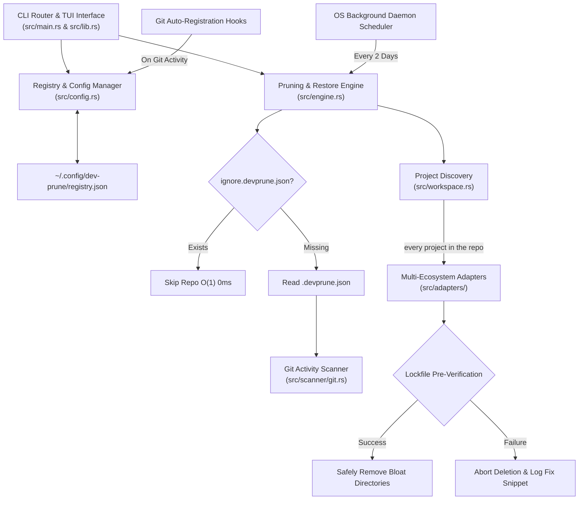

# 🏗️ `dev-prune` System Architecture

Welcome to the technical architecture guide for **`dev-prune`** (`devp`), a cross-platform, multi-ecosystem workspace maintenance CLI and background automation tool written in Rust (edition 2024).

---

## 🖼️ System Visual Overview

---

## 🏛️ Architecture Specifications

The system architecture and technical design specifications are divided into two dedicated documents:

### 1. 📐 [High-Level Design Specification (HLD)](architecture/HLD.md)
- Multi-layer system architecture (Interface Layer, Core Engine, Adapter Subsystem, Background Automation).
- Component interaction flowcharts and sequence diagrams.
- Execution lifecycle sequences and system boundaries.

### 2. 🔬 [Low-Level Design Specification (LLD)](architecture/LLD.md)
- Complete crate module map (`src/`).
- Data schemas for global `registry.json` and per-repository `.devprune.json`.
- `PackageManager` trait contract, multi-adapter resolution and intra-repository project discovery.
- Atomic state file swap algorithm (`registry.json.tmp` -> `registry.json`).
- Binary alias linkage (`dev-prune` <-> `devp`) and CWD determinism mechanics.

---

## 🔄 Architectural Overview

*Figure 1: High-level overview of system components.*
