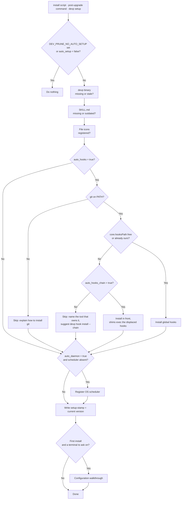
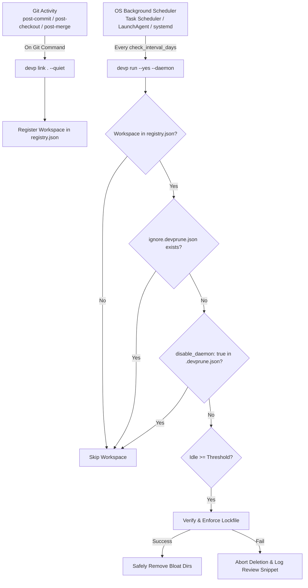

# 🤖 Background Automation & Subsystems in `dev-prune`

`dev-prune` (`devp`) ships native background automation subsystems for Windows, macOS, and Linux. **They install themselves.** A pruner you have to remember to run is a pruner that never runs, so the parts that make dev-prune work unattended are put in place for you — once, at install time, and again after an upgrade if anything went missing.

---

## ⚡ The setup pass

`devp setup` installs whatever is missing and leaves whatever is already there alone. It runs in three situations, and it is the same code in all three:

| When | Trigger |
| --- | --- |
| Installation | `scripts/install.sh` / `scripts/install.ps1` call `dev-prune setup` as their last step |
| First command after an upgrade | The stamp file `setup-stamp` in the config directory no longer matches the running version |
| Onboarding | `devp init` runs it, so registering repositories and installing the integrations are one step |
| On request | You type `devp setup` |

It installs five things:

1. **The `devp` second binary** — a real executable of the same name in the same directory, not a shell alias, so `devp` works in every shell, in an IDE terminal and in the scheduled task rather than only in the shell whose profile was edited. Refreshed when it no longer matches the binary, so an upgrade cannot leave `devp` running the previous version.

2. **`SKILL.md`** — exported to the config directory so AI assistants have an accurate description of the tool to read. Rewritten whenever it differs from the copy compiled into the binary.

3. **File-manager icons** — `*.devprune.json` registered with the OS file manager, and the icon assets plus the JSON Schema written into the config directory. Everything it writes lives under your own config and data directories and is removed by `devp uninstall`. It touches no editor settings, no PATH and no shell profile; for editors it only prints a snippet you can paste.

4. **Git hook auto-registration** — non-blocking `post-commit`, `post-checkout` and `post-merge` hooks that run `dev-prune link . --quiet` in the background, so repositories you clone or create get tracked without a manual `devp link`.

   ⚠️ This sets the **global** `core.hooksPath`, and Git supports exactly one hooks directory with no way to chain two. While it is active, per-repo `.git/hooks` are ignored **machine-wide**.

   dev-prune does not simply give up when husky, pre-commit or lefthook already hold the slot. `devp hook install --chain` takes it and writes, for every hook name, a shim that does dev-prune's own work and then `exec`s the same-named hook in the directory it displaced — same arguments, same stdin (which `pre-push` reads its refs from), same exit code, so a failing pre-commit check still blocks the commit. `devp hook uninstall` restores the original `core.hooksPath`.

   Chaining is **opt-in** (`auto_hooks_chain`, default `false`): it is behaviour-preserving, but it still rewires another tool's Git configuration, which is not something an unattended install should decide for you. With it off, the pass skips the step and says who holds the slot. It also skips if `git` is not on `PATH`, with instructions to install it.

   The chain is a snapshot. If the other tool later adds a hook there is no shim for, that hook stops firing — `devp hook status` names the drifted hooks, and `devp hook install --chain` rebuilds.

   Repositories that set `"disable_hooks": true` in `.devprune.json` are not auto-registered by the hook.

   Neither is anything under the OS temporary directory. A repository there is scratch by definition — a test fixture, a `git clone` into `mktemp -d`, a build step — and it is gone minutes after its first commit, leaving a registry entry that can never be pruned and never be found again. An explicit `devp link` in one still works; the hook simply declines to do it unasked. If a registry has already collected entries like that, `devp unlink --missing` clears all of them at once.

5. **The OS scheduler** — a Windows scheduled task, a macOS LaunchAgent, or a systemd user timer that runs `dev-prune run --yes --daemon` every `check_interval_days` days (default 2).

   Repositories that set `"disable_daemon": true` in `.devprune.json` are excluded from this pass but stay pruneable by a manual `devp run`.

One thing is deliberately **not** in the pass: repository registration. Which directories to track is your decision, and no install should guess at it.

On a genuinely fresh install the pass is followed once by the configuration walkthrough — every setting, its current value and its default, Enter to keep it — so the defaults are something you agreed to. It runs only when there is a terminal to ask on, and only once: it is keyed to the config directory, not to the version stamp, because being asked to reconfirm `idle_days` after every upgrade would be a nuisance.


*Figure 1: What `devp setup` does, and every point at which it declines to.*

### Turning it off

Four switches, from narrowest to widest:

```bash
devp config set auto_hooks_chain false   # never displace another tool's hooks (already the default)
devp config set auto_daemon false        # no OS scheduler
devp config set auto_hooks false         # no global git hooks
devp config set auto_setup false         # no automatic pass at all
```

For containers, CI images and automated builds, set the environment variable instead — it needs no config file and overrides all of them:

```bash
export DEV_PRUNE_NO_AUTO_SETUP=1
```

To skip the pass at install time, the installers take a flag — `--no-auto-setup` for the shell script, `-NoAutoSetup` for the PowerShell one — and read `DEV_PRUNE_NO_AUTO_SETUP=1` as the equivalent for a one-liner that has nowhere to put an argument. Both are read before `dev-prune setup` is ever called; see [Installer options](RELEASES_AND_MANUAL_INSTALL.md#installer-options).

Being honest about the environment variable: by the time you can type `DEV_PRUNE_NO_AUTO_SETUP=1 devp …`, dev-prune is already installed, so as a way of avoiding the first pass it is redundant with the flag. It stays because its real job is the *steady state*: a Dockerfile or CI image that has the variable in its environment gets no scheduler, no hooks and no writes outside the config directory on any later command, without needing a config file baked in. dev-prune also detects CI and container environments by itself (`CI`, `GITHUB_ACTIONS`, `/.dockerenv`, `container`, and friends) and treats them as unattended without being told, so in practice the variable is for the cases that detection misses.

`devp uninstall` removes the scheduler, the hooks and the `devp` copy, and stamps the current version so the next command does not put them straight back. The next *upgrade* will, unless you also set `auto_setup false`.

The variable is symmetric: with `DEV_PRUNE_NO_AUTO_SETUP=1` set, `devp uninstall` is hands-off about the same integrations it never would have installed — it leaves the scheduler and the agent skills alone (saying so in its output), and its stray-copy sweep searches only the directories on `PATH` rather than guessing extra install locations from the home folder. Managing the integrations by hand includes removing them by hand.

`devp setup --status` reports what is installed, what is not, and why, without changing anything.

---

## ⚙️ Background Subsystem Execution Flow


*Figure 1: Background Automation Execution Architecture.*

#### Diagram Description & Element Breakdown
- **OS Background Scheduler**: Native OS scheduler executing background maintenance every 2 days.
- **Git Activity**: Shell triggers firing on Git commits, checkouts, or merges.
- **HookRegister**: Registers current Git repository in `registry.json` with zero execution delay.
- **RegisterWorkspace**: Appends workspace path to `~/.config/dev-prune/registry.json`.
- **DaemonPass**: Silent background pruning pass across registered workspaces.
- **CheckReg**: Validates if directory path is registered.
- **CheckIgnoreFile**: Fast 0ms presence check for `ignore.devprune.json`.
- **CheckDisableDaemon**: Reads per-repo `.devprune.json` setting for `disable_daemon`.
- **CheckIdle**: Evaluates git commit log and file `mtime` modification timestamps.
- **EnforceLockfile**: Safety gate executing lockfile verification pass with timeout.
- **Prune**: Removes bloat directories (`node_modules`, `.venv`, `target`, `vendor`).
- **Abort**: Preserves files if lockfile verification fails.

---

## 🛠️ CLI Controls & Configuration

Even though background subsystems run automatically, developers have granular controls via the CLI:

### 1. Background Daemon Controls
- **Check Status**:
  ```bash
  devp status daemon
  # Alias for: devp config daemon status
  ```
- **Disable for Current Workspace**:
  ```bash
  devp config . daemon disable
  # Sets disable_daemon: true in .devprune.json
  ```
- **Disable / Enable Globally**:
  ```bash
  devp config daemon disable
  devp config daemon enable
  ```

### 2. Git Hook Controls
- **Check Git Hook Status**:
  ```bash
  devp status hook
  # Alias for: devp config hook status
  ```
- **Disable Hooks for Current Workspace**:
  ```bash
  devp config . hook disable
  # Sets disable_hooks: true in .devprune.json
  ```
- **Disable / Enable Hooks Globally**:
  ```bash
  devp config hook disable
  devp config hook enable
  ```

---

## 🖥️ OS-Native Scheduler Specifications

### Windows: Task Scheduler (`schtasks`)
- **Task Name**: `DevPrune`
- **Schedule**: Every 2 days
- **No terminal window**: the task runs `devpw.exe`, a windowless build of the binary
  generated locally beside the managed copy — the same relationship `pythonw.exe` has to
  `python.exe`. It has no console for Windows to show, so nothing flashes at the
  logged-in user, and because it still runs in your own session it keeps access to mapped
  network drives and Dev Drives. If that build cannot be created, setup falls back to a
  hidden password-less task (an S4U logon), then to a visible task, so the daemon is
  never lost. Details and diagnostics in
  [INSTALLATION_ISSUES.md §10](troubleshooting/INSTALLATION_ISSUES.md#10-a-terminal-window-flashes-briefly-after-logging-in-windows).
- **PowerShell Verification**:
  ```powershell
  schtasks /Query /TN DevPrune
  ```

### macOS: LaunchAgent (`plist`)
- **Location**: `~/Library/LaunchAgents/com.devprune.daemon.plist`
- **Schedule**: Every 172,800 seconds (2 days)
- **No terminal window**: launchd runs a LaunchAgent without attaching a terminal, so a
  background pass is invisible by design — there is nothing to hide and nothing to
  configure.
- **Launchctl Verification**:
  ```bash
  launchctl list | grep devprune
  ```

### Linux: systemd User Timer
- **Service**: `$XDG_CONFIG_HOME/systemd/user/dev-prune.service` (default `~/.config/systemd/user/`)
- **Timer**: `$XDG_CONFIG_HOME/systemd/user/dev-prune.timer`
- **Trigger**: `OnBootSec=` plus `OnUnitActiveSec=`, so a machine that was switched off still gets its pass shortly after the next boot.
- **No terminal window**: a systemd user timer runs its service without a controlling terminal, so the background pass never opens one.
- **Systemctl Verification**:
  ```bash
  systemctl --user status dev-prune.timer
  ```
