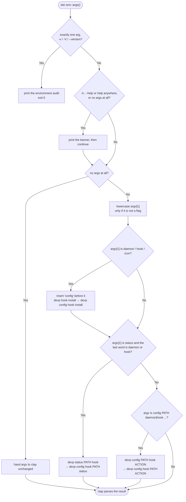

# `dev-prune` & `devp` Complete CLI Command Reference

`dev-prune` (executable via its shorthand alias **`devp`**) provides a full set of subcommands, global flags, configuration options, and status shortcuts for universal workspace maintenance.

---

## ⚡ Two Names for One Binary

`devp` is **not** a shell alias, a PowerShell profile function or a `doskey` macro — it is
a second executable sitting next to `dev-prune`. Both names behave identically and can be
used interchangeably in any terminal:
```bash
dev-prune status
devp status
```

On installation, `dev-prune` creates a hard link (or, where that is not possible, a copy) named `devp` alongside `dev-prune`, so both names work in every shell — cmd, PowerShell, bash, fish, an IDE terminal, a scheduled task — without a profile alias that has to be re-sourced. It is refreshed whenever it no longer matches the binary, so an upgrade cannot leave `devp` running the previous version.

---

## 🔤 How arguments are read

Before clap parses anything, [`normalize_args()`](../src/lib.rs) rewrites the argument
vector so that the phrasings people actually type resolve to the real subcommand. This is
the only rewriting that happens; nothing else about your arguments is second-guessed.



Practical consequences:

- `devp STATUS`, `devp Status` and `devp status` are the same command. Only the
  subcommand word is lowercased — paths and values keep their case, which matters on
  case-sensitive filesystems.
- `devp hook install` and `devp config hook install` are the same command, and so are
  `devp status ~/proj hook` and `devp config hook ~/proj status`.
- An unrecognised subcommand is **not** guessed at. It reaches clap and exits `2`.

---

## 🚩 Global Flags

| Flag | Short | Description |
| :--- | :---: | :--- |
| `--dry-run` | | Simulate pruning without deleting files or running lockfile updates |
| `--ignore-idle` | | Prune repositories you are still working in. Lifts the idle-day threshold and **nothing else** — lockfile verification, `ignore.devprune.json`, `"ignore": true`, the size floor, symlink refusal and nested-repository refusal all still apply |
| `--force` | | Deprecated spelling of `--ignore-idle`. Still accepted. Prints the rename note and, because nobody types it for fun, the full list of the seven reasons a directory gets skipped and how to fix each one |
| `--yes` | `-y` | Bypass interactive confirmation prompts |
| `--help` | `-h` | Print help information |
| `--version` | `-V` | Display rich version, system architecture, and PATH audit details |

`--force` was renamed because the word promised something it never delivered: it reads
like "override the safety checks", and it only ever skipped the idle-day wait. No flag
bypasses lockfile verification, and none ever will.

Wherever a command takes `[PATH]`, a `.` means the current working directory — and it is
the default for `init`, `link`, `unlink`, `restore` and `config project`, so `devp link`
and `devp link .` are the same command. `devp run` is the deliberate exception: with no
path it runs across *every* registered repository, so pruning one project has to be asked
for by name. A leading `~` is expanded by dev-prune itself rather than by the shell, which
means `devp init ~/Code` works identically in bash, PowerShell and cmd, and keeps working
when the argument is quoted.

---

## 🔢 Exit Codes

| Code | Meaning |
| :---: | :--- |
| `0` | Success. A prune that deleted nothing because nothing was idle is a success, and so is a cancelled TUI selection. Also used when output is piped into a reader that closes early (`devp status \| head`). |
| `1` | The command failed. The reason is printed to stderr. |
| `2` | The arguments were not usable — unknown subcommand, missing value, invalid action word. |

---

## 💻 Subcommands

### 1. `devp init [PATHS...]`
- **Aliases**: `scan`, `onboard`
- **Description**: Crawls the provided directory trees (defaults to current directory `.`, max depth 8) for valid Git repositories and registers them in `~/.config/dev-prune/registry.json` (`%APPDATA%\dev-prune\` on Windows, `~/Library/Application Support/dev-prune/` on macOS). It then runs the same integration pass as [`devp setup`](#11-devp-setup---status), installing anything missing and reporting anything it skipped, and checks for a newer release the same way [`devp update`](#10-devp-update---offline) does.
- **Examples**:
  ```bash
  devp init ~/Code
  devp init /path/to/project1 /path/to/project2
  ```

---

### 2. `devp link [PATH]`
- **Description**: Registers a single Git repository for pruning (defaults to current directory `.`).
- **Examples**:
  ```bash
  devp link
  devp link /path/to/my-repo
  ```

---

### 3. `devp unlink [PATH]`
- **Description**: Removes a repository from the `dev-prune` registry. Does **not** delete any workspace files on disk.
- **Flags**:
  - `--missing` — remove every registered path whose directory no longer exists, instead of one named repository. Clones that were deleted, drives that were reformatted and workspaces that were moved all leave entries behind; [`devp doctor`](#12-devp-doctor-path) counts them in a single warning and sends you here rather than printing one `devp unlink` line per dead path. Conflicts with `PATH`.
- **Examples**:
  ```bash
  devp unlink
  devp unlink /path/to/my-repo
  devp unlink --missing
  ```

---

### 4. `devp undo`
- **Description**: Reverts the most recent `init` or `link` registration action.
- **Examples**:
  ```bash
  devp undo
  ```

---

### 5. `devp run [TARGET_PATH]`
- **Description**: Executes a prune pass across all registered repositories or a specific target repository path.
  1. Checks for 0ms fast-path `ignore.devprune.json` file.
  2. Evaluates repository inactivity (`git log` commit history + source `mtime` modification timestamps).
  3. Discovers every package-manager project in the repository — the root and up to `scan_depth` levels below it (six by default).
  4. Pre-verifies required package manager binaries (`npm`, `pnpm`, `uv`, `cargo`, `go`, etc.).
  5. Calculates reclaimable disk space and launches interactive selection TUI (unless `-y` is passed).
  6. Enforces two-tier lockfile safety with configurable command timeout (`command_timeout_secs`).
  7. Safely removes bloat directories (`node_modules`, `.venv`, `target`, `vendor`).
- **Flags**:

  | Flag | Meaning |
  | :--- | :--- |
  | `--only <ADAPTERS>` | Restrict the pass to a comma-separated list of package managers |
  | `--skip <ADAPTERS>` | Exclude a comma-separated list of package managers |
  | `--min-size <MIB>` | Ignore bloat directories smaller than this, overriding `min_size_mb` for the run |
  | `--except <REPOS>` | Prune every registered repository *except* these (comma-separated) |
  | `--daemon` | Mark this as the scheduled background pass; repositories that set `disable_daemon` are skipped. Set by the installed scheduler |
  | `--json` | Emit one machine-readable document instead of the human report |

  Adapter names are `npm`, `pnpm`, `yarn`, `bun`, `uv`, `venv`, `cargo`, `go`. An
  unrecognised name is an error listing the valid ones rather than a silently empty pass,
  and `--only` and `--skip` cannot be combined.

  `--except` is the safe spelling of "clean up but keep the API project". Each entry
  matches a registered repository by full path, by directory name, or case-insensitively
  with any trailing slash ignored, and a leading `~` is expanded — a comma-separated list
  arrives as one argument, so no shell would expand a `~` sitting inside it. An excluded
  repository is never verified, never deleted and never restored, which is the difference
  between skipping it and pruning it and downloading it all back. The same shape is
  available interactively: `devp status` → `p` pre-selects every candidate, and `Space`
  deselects the one you are keeping.
- **Examples**:
  ```bash
  devp run --dry-run
  devp run
  devp run ~/Code/MyProject
  devp run --ignore-idle -y
  devp run --except api-service,~/Code/playground
  devp run --only cargo,uv --dry-run
  devp run --skip venv --min-size 50
  devp run --json --dry-run
  ```

Directories are reported by their path relative to the repository root, so a monorepo
reads unambiguously:

```
  • MyMonorepo → frontend/node_modules (412.7 MB) [pnpm]
  • MyMonorepo → services/api/.venv (188.2 MB) [uv]
  • MyMonorepo → tools/cli/target (1.4 GB) [cargo]
```

---

### 6. `devp status [--top N] [--json]`
- **Description**: Displays an interactive Ratatui terminal dashboard summarizing registered repositories, status (Candidate, Active, Ignored, No Bloat, Path Missing, Unreadable `.devprune.json`), reclaimable space, and last activity date. A repository whose `.devprune.json` does not parse is reported as such rather than as a candidate — `devp run` refuses to touch it, and the dashboard says the same thing.
- **Interactive TUI Keybindings**:
  | Key | Action |
  | :--- | :--- |
  | `↑` `↓` / `k` `j` | Move the selection |
  | `PgUp` `PgDn` | Jump ten rows |
  | `Home` `End` / `g` `G` | Jump to the first or last row |
  | `p` | Enter Prune-Select mode, with every candidate pre-selected |
  | `Space` | Toggle the current row (Prune-Select mode) |
  | `a` | Toggle every candidate (Prune-Select mode) |
  | `Enter` | Prune the selected repositories (Prune-Select mode) |
  | `i` | Toggle `ignore` in the repository's `.devprune.json`; the table refreshes immediately |
  | `Esc` | Leave Prune-Select mode, or exit from the browse view |
  | `q` / `Ctrl-C` | Exit the dashboard |

  The terminal is restored on every exit path, including an error or a panic inside the view.

  With no TTY — piped, redirected, or run from a scheduler — `devp status` prints a plain
  table instead of entering the TUI. `--json` replaces it with a machine-readable document
  and makes no changes of any kind.
- **Flags**:
  - `--top <N>` — list only the `N` repositories with the most reclaimable space. On a
    machine tracking a hundred repositories the handful worth pruning are otherwise pushed
    off the screen. The survivors stay in the dashboard's usual order, so the list reads as
    a shorter version of the full one rather than a re-sorted one. **The totals above the
    table are unaffected** — they are computed over every registered repository, so
    `--top 5` cannot make a machine look tidier than it is. Applies to the TUI, the plain
    table and `--json` alike; in JSON the trim is reported as a top-level `"top"` field.
  - `--json` — emit one machine-readable document instead of the dashboard.
- **Examples**:
  ```bash
  devp status --top 10
  devp status --top 10 --json | jq '.repositories[].path'
  ```
- **Status Shortcuts & Aliases**:
  - `devp status daemon` (alias for `devp config daemon status`): Inspect OS background daemon scheduler status.
  - `devp status hook` (alias for `devp config hook status`): Inspect Git auto-registration hook status.

---

### 7. `devp caches [--json]`
- **Description**: Finds every package-manager cache and store on the machine, sizes each one, and prints the command that clears it. Largest first, with a total. **It deletes nothing** — there is no flag that makes it delete anything.
- **Why it only reports**: a cache lives outside every repository and is shared by all of them, so no single lockfile can prove its contents are recoverable — which is the bar every deletion in dev-prune has to clear. It is also what makes [`devp restore`](#9-devp-restore-path---last-run) fast: clearing a cache turns the next reinstall into a download. So the clear command is printed for you to run deliberately, when you want the space more than the speed.
- **What it looks at**:

  | Manager | Cache | Cleared by |
  | :--- | :--- | :--- |
  | `npm` | cache | `npm cache clean --force` |
  | `pnpm` | store | `pnpm store prune` |
  | `yarn` | cache | `yarn cache clean` |
  | `bun` | cache | `bun pm cache rm` |
  | `uv` | cache | `uv cache prune` |
  | `pip` | cache | `pip cache purge` |
  | `cargo` | registry cache, registry sources | deleting `$CARGO_HOME/registry/{cache,src}` — cargo ships no cache subcommand |
  | `go` | module cache, build cache | `go clean -modcache`, `go clean -cache` |

  Each manager is *asked* where its cache is (`npm config get cache`, `pnpm store path`, `go env GOMODCACHE`, …) rather than assumed, because `CARGO_HOME`, a `--cache-dir` and a corporate `.npmrc` all move it. Every one of those queries is read-only and is run from your home directory, so a project-local `.npmrc` cannot skew a machine-wide answer. A manager that is not installed falls back to the conventional location — a cache left behind by a manager you uninstalled is exactly the multi-gigabyte directory nobody remembers. Two probes that resolve to the same directory are counted once.
- **Flags**:
  - `--json` — emit one machine-readable document instead of the table.
- **Examples**:
  ```bash
  devp caches
  devp caches --json | jq '.summary.total_bytes'
  ```

---

### 8. `devp config [ACTION]`
- **Description**: Manage global settings, per-repository configuration (`.devprune.json`), background daemons, Git hooks, or the OS file manager's icon for `.devprune.json`.
- **Sub-Actions**:
  - `config get <key>`: View a global setting.

    | Key | Default | Meaning |
    | :--- | :---: | :--- |
    | `idle_days` | `15` | How long a repository must be untouched before it is a prune candidate |
    | `min_size_mb` | `0` | Smallest bloat directory worth deleting, in MiB; `0` disables the floor |
    | `scan_depth` | `6` | How many directory levels below a repository root discovery descends. Clamped to `32`; every extra level costs walk time |
    | `require_confirmation` | `true` | Whether a prune pass asks before deleting |
    | `allow_manifest_rewrite` | `false` | Whether verification may *repair* a lockfile that has drifted from its manifest, instead of refusing. Off, every adapter verifies read-only; on, each runs its writing form (`npm install --package-lock-only`, `uv lock`, `cargo generate-lockfile`, `go mod tidy`, …) |
    | `command_timeout_secs` | `600` | Ceiling on any one package-manager command run during lockfile verification |
    | `auto_setup` | `true` | Whether the integration pass may run unattended at all |
    | `auto_daemon` | `true` | Whether that pass may register the OS scheduler |
    | `check_interval_days` | `2` | How often the OS scheduler runs a pass |
    | `auto_hooks` | `true` | Whether that pass may install the global Git hooks |
    | `auto_hooks_chain` | `false` | Whether it may take a `core.hooksPath` another tool holds, forwarding every hook on to it |
    | `update_check` | `true` | Whether the periodic release check runs (see [`devp update`](#10-devp-update---offline)) |
    | `update_check_interval_days` | `7` | Minimum gap between two release checks |
    | `update_check_timeout_secs` | `5` | How long that one request may hang before it is abandoned |

    Three of these have a per-repository form in that repository's `.devprune.json`,
    where they win for that tree only: `idle_days` (spelled `override_idle_days` there),
    `min_size_mb` and `scan_depth` — the three whose right value genuinely depends on the
    project rather than on you. The rest are deliberately global. Nothing stops a project
    from committing its `.devprune.json`, so a per-repository `allow_manifest_rewrite`
    would let a repository you have never read grant itself permission to have its own
    tracked manifests rewritten during an unattended pass; `auto_*` and `update_check*`
    describe your machine, not a project, and would mean nothing per repository.

    A value outside the accepted range is rejected with the range in the message, not
    silently clamped — except `scan_depth`, which is clamped to `32` because a deeper walk
    is a performance mistake rather than a request that cannot be honoured.

  - `config set <key> <value>`: Modify global setting value.
  - `config show [--update]`: View all configuration values or force global update.
  - `config wizard`: Walk through every setting one at a time, showing the current value
    and its default, and press Enter to keep it. This runs itself once on a first
    install, so the defaults are something you agreed to rather than something you
    inherited. It never runs unattended: no TTY means it is skipped, not guessed at.
  - `config project [PATH] [--update]`: Inspect or create per-repository `.devprune.json` config.
  - `config daemon [PATH] [enable|disable|status]`: Configure OS background scheduler globally or for workspace.
  - `config hook [PATH] [enable|disable|status] [--chain]`: Configure Git auto-registration hooks globally or for workspace.

    Git has exactly one global `core.hooksPath` and no way to chain two, so a tool that
    holds it shuts every other one out machine-wide. `--chain` is the way out: dev-prune
    takes the slot and writes, for each hook, a small shim that does its own work and then
    `exec`s the same-named hook in the directory it displaced. husky, pre-commit and
    lefthook keep firing, in order, with their own arguments and their own exit codes —
    a non-zero exit from the displaced hook is still a non-zero exit, so a pre-commit
    check that fails still blocks the commit. `devp hook uninstall` puts the original
    `core.hooksPath` back. It is opt-in (`auto_hooks_chain`, `false`) because rewiring
    another tool's Git configuration unasked is not something an install should do.

    The chain is a snapshot of the other tool's directory at install time. If that tool
    later adds a hook dev-prune has no shim for, that hook stops firing — `devp hook
    status` reports exactly which names have drifted, and `devp hook install --chain`
    rebuilds the chain.

    Both rewrite the whole `.devprune.json`, so both refuse a file that does not parse
    rather than starting from the defaults and taking every other override in it with
    them. Fix the file, or run `devp config <PATH> --update` to reset it deliberately.

  - `config icon`: Register `*.devprune.json` with the OS file manager and write the icon files and JSON Schema into the config directory. On Linux this is a complete registration — a `shared-mime-info` package plus hicolor icons, honoured by Nautilus, Dolphin, Thunar, Nemo and PCManFM. On Windows, Explorer resolves icons from the last extension only, so `*.devprune.json` cannot be distinguished from any other `.json` without hijacking every JSON file on the machine; the config folder gets its own icon instead. On macOS a UTI must come from an application bundle, which a single binary is not. The command also prints an editor snippet you can paste yourself — it never edits your editor settings, your PATH, or your shell startup files.
- **Examples**:
  ```bash
  devp config get idle_days
  devp config set command_timeout_secs 1200
  devp config daemon status
  devp config . daemon disable
  devp config icon
  ```

#### Shorthands

`daemon`, `hook` and `icon` may be typed without the leading `config`, and the
enable/disable actions accept the words people reach for:

| You type | Runs |
| :--- | :--- |
| `devp hook install` | `devp config hook enable` |
| `devp hook uninstall` | `devp config hook disable` |
| `devp hook` | `devp config hook status` |
| `devp daemon on` / `devp daemon off` | `devp config daemon enable` / `disable` |
| `devp icon` | `devp config icon` |

Accepted action words: `enable` / `install` / `on`, `disable` / `uninstall` / `remove` /
`off`, and `status` / `show`. Anything else is rejected with an error — a mistyped
action never silently degrades into a status report.

---

## 🤖 Machine-readable output (`--json`)

`devp run --json`, `devp status --json`, `devp stats --json` and `devp caches --json` each
emit exactly one JSON document on stdout and nothing else. `status --json` and
`stats --json` make no changes of any kind — not even to the registry file — and
`caches --json` never touches anything but the sizes it reads.

Every document carries `schema`, an integer that increases only when a consumer would
have to change to keep working: a field removed, renamed, or given a new meaning. **Adding
a field does not bump it**, so parse permissively and ignore what you do not recognise.
The current version is `1`.

### `devp run --json`

```jsonc
{
  "schema": 1,
  "version": "1.1.0",
  "command": "run",
  "dry_run": true,
  "results": [
    {
      "repository": "~/Code/api",
      "adapter": "pnpm",
      "directory": "node_modules",
      "status": "skipped_dry_run",
      "bytes": 481296384
      // "message"     — present only on the three failure statuses
      // "fix_command" — present only on `lockfile_error`, and only when the fix is a
      //                 single mechanical command an agent can run unattended
    }
  ],
  "summary": {
    "bytes_freed": 0,          // only actual deletions; a dry run always reports 0
    "bytes_reclaimable": 481296384,
    "directories_pruned": 0,
    "errors": 0                // lockfile_error + delete_error + config_error
  }
}
```

| `status` | Meaning |
| :--- | :--- |
| `pruned` | The directory was deleted. |
| `skipped_dry_run` | A candidate, left in place because this was a dry run. |
| `skipped_active` | The repository has been touched inside its idle window. |
| `ignored` | The repository sets `"ignore": true`, or has an `ignore.devprune.json`. |
| `no_bloat` | Nothing to delete. |
| `disabled` | The registry entry is disabled. |
| `lockfile_error` | The lockfile could not be verified, so nothing was deleted. |
| `delete_error` | Deletion was attempted and failed. |
| `config_error` | `.devprune.json` does not parse; the repository was not touched. |

### `devp status --json`

```jsonc
{
  "schema": 1,
  "version": "1.1.0",
  "command": "status",
  "config_path": "~/.config/dev-prune/registry.json",
  "integrations": { "daemon": "...", "git_hooks": "..." },
  "settings": { "idle_days": 15, "min_size_mb": 0, "update_check": true /* ... */ },
  "top": 10,  // present only when --top was passed; `repositories` is trimmed, `totals` is not
  "totals": {
    "repositories": 12,
    "candidates": 3,
    "reclaimable_bytes": 4812963840,
    "historical_bytes_freed": 0,
    "prune_passes": 0  // passes that deleted something — not repositories, not directories
  },
  "repositories": [
    {
      "path": "~/Code/api",
      "state": "candidate",
      "enabled": true,
      "idle_days": 15,
      "last_activity": "2026-05-02T09:14:00+00:00",  // null if none could be determined
      "last_pruned_at": null,
      "added_at": "2026-04-11T18:22:31+00:00",
      "adapters": ["pnpm"],
      "reclaimable_bytes": 481296384,
      "directories": [{ "name": "node_modules", "path": "~/Code/api/node_modules", "bytes": 481296384 }]
      // "error" — present only when `state` is `config_error`, carrying the parse failure
    }
  ]
}
```

`state` is one of `candidate`, `active`, `ignored`, `no_bloat`, `path_missing`, or
`config_error`. `last_activity` is the later of the last commit and the newest source file
mtime — the same value the idle decision uses, so the two can never disagree.

### `devp stats --json`

```jsonc
{
  "schema": 1,
  "version": "1.1.0",
  "command": "stats",
  "history_starts_at": "1.1.0",  // the version that began recording the two sections below
  "lifetime": {
    "bytes_freed": 6772391936,
    "prune_passes": 9,           // same number and same meaning as totals.prune_passes above
    "repositories": 12
  },
  "last_prune": {                // null if nothing has ever been pruned
    "at": "2026-08-11T14:02:55+00:00",
    "bytes_freed": 812963840,
    "directories": 4
  },
  "recent_passes": [             // newest first, capped at 50 passes; empty before 1.1.0
    { "at": "2026-08-11T14:02:55+00:00", "bytes_freed": 812963840, "directories": 4, "repositories": 2 }
  ],
  "repositories": [              // biggest first; bytes_freed is only recorded from 1.1.0
    { "path": "~/Code/api", "bytes_freed": 481296384, "last_pruned_at": "2026-08-11T14:02:55+00:00" }
  ]
}
```

`lifetime.bytes_freed` and `lifetime.prune_passes` have been accumulating since 1.0.0.
`recent_passes` and the per-repository `bytes_freed` were not recorded before 1.1.0, so on
an upgraded machine they start from zero while the lifetime figures do not — which is what
`history_starts_at` is there to tell a consumer.

### `devp caches --json`

```jsonc
{
  "schema": 1,
  "version": "1.1.0",
  "command": "caches",
  "caches": [
    {
      "manager": "uv",
      "kind": "cache",
      "path": "~/.cache/uv",
      "bytes": 17448304640,
      "clear_command": "uv cache prune"
      // "note" — present only when clearing this cache costs more than time
    }
  ],
  "summary": {
    "total_bytes": 29268434944,
    "count": 9
  }
}
```

`caches` is ordered largest first, the same as the table. Only caches that exist on the
machine appear, so `count` is a count of what was found rather than of what was looked
for. `clear_command` is a suggestion printed for a human — dev-prune never runs it.

Every document is emitted to stdout; diagnostics go to stderr, so `devp status --json |
jq` is always safe. Exit codes are unchanged by `--json`.

---

### 9. `devp restore [PATH] [--last-run]`
- **Description**: Detects applicable package manager lockfiles (`package-lock.json`, `pnpm-lock.yaml`, `uv.lock`, `Cargo.lock`, `go.sum`) and re-installs missing dependencies (`npm ci`, `pnpm install`, `uv sync`, etc.). Mirrors pruning: every project in the tree is restored, each by its own manager.
- **Flags**:
  - `--last-run` — restore exactly what the most recent prune pass deleted, across every repository it touched, and nothing else. Each prune records what it removed; a pass that deleted nothing leaves the previous record intact, and a `--dry-run` records nothing at all. Fails if no pass has been recorded yet. Cannot be combined with a `PATH` — silently ignoring the path would restore the wrong thing.
- **Examples**:
  ```bash
  devp restore
  devp restore ~/Code/my-app
  devp restore --last-run       # undo the last prune pass
  ```

---

### 10. `devp update [--offline]`
- **Description**: Prints the installed version, asks GitHub's public API for the latest release, and shows the upgrade command for how you installed it. It never downloads or replaces its own binary — upgrade with `cargo binstall dev-prune --force`, `cargo install dev-prune --force`, `npm install -g dev-prune`, or by re-running the installer script.
- **Flags**:
  - `--offline` — skip the release check for this run without changing the setting.
- **The check is opt-out, not opt-in.** It also runs quietly from `devp run` and `devp status`, at most once every 7 days, and prints one line only when a newer version exists. Disable it permanently with `devp config set update_check false`. It sends no body, no identifier and no usage data — see [PRIVACY.md](PRIVACY.md).
- **Examples**:
  ```bash
  devp update
  devp update --offline
  ```

---

### 11. `devp setup [--status]`
- **Description**: Installs whatever dev-prune integration is missing and leaves the rest alone: the `devp` alias, the exported `SKILL.md`, the file-manager icon registration for `*.devprune.json`, the global Git auto-registration hooks, and the OS scheduler. Safe to run repeatedly — it is the same pass the install scripts run, the same one `devp init` runs, and the same one that runs by itself on the first command after an upgrade.
- **`--status`**: Report what is installed, what is not, and which automation settings are in force. Changes nothing.
- **Skips, rather than forces**:
  - Git hooks, when `git` is not on `PATH` (with instructions to install it), or when `core.hooksPath` already belongs to husky, pre-commit or lefthook and `auto_hooks_chain` is off. Take the slot without displacing that tool: `devp hook install --chain`.
  - The alias, when the running process *is* `devp` and the file cannot be replaced under it (Windows).
  - Anything switched off by `auto_setup`, `auto_hooks`, `auto_daemon`, or `DEV_PRUNE_NO_AUTO_SETUP=1`.
- **Examples**:
  ```bash
  devp setup
  devp setup --status
  DEV_PRUNE_NO_AUTO_SETUP=1 devp init ~/code   # register repositories, install nothing
  ```

See [Background Automation](BACKGROUND_AUTOMATION.md) for the full decision flow.

---

### 12. `devp doctor [PATH]`
- **Description**: One read-only pass that answers "why is this not doing what I expect". Without a path it checks the installation; with one it checks that repository and ends by naming the single reason a prune pass would or would not touch it. It changes nothing — no config is created, no integration installed, no package manager run.
- **Without a path** it reports: version, executable location, whether `devp` sits beside it and whether that directory is on `PATH`; the config directory and whether `registry.json` parses; every stored setting revalidated against the range its own `config set` enforces; `SKILL.md`, file icons, Git hook state, the scheduler and the three `auto_*` settings; the package-manager binaries the registered repositories actually need; the registry's own health (missing paths, unreadable per-repo configs, reclaimable totals); and the release-check state.
- **With a path** (`devp doctor .`) it reports: whether it is a Git repository, whether it is registered, any opt-out in force, whether `.devprune.json` parses and what it overrides, the effective idle threshold against real activity, the effective size floor and scan depth, then every discovered project with its manager, whether the file that gates it is present, and each bloat directory's size and status.
- **Exit codes**: `0` when everything works, warnings included — a missing scheduler should not fail a script. `1` only for something actually broken: an unreadable `registry.json`, an out-of-range setting, a registered path that no longer exists, a directory that is not a Git repository.
- **Examples**:
  ```bash
  devp doctor              # the installation
  devp doctor .            # this repository
  devp doctor ~/Code/api
  ```

---

### 13. `devp skill`
- **Description**: Exports [`SKILL.md`](../.agents/skills/dev-prune/SKILL.md) into the config directory and displays ready-to-copy AI Agent onboarding prompts for AI assistants (Gemini Antigravity, Claude Code, Cursor, Windsurf, Copilot, OpenClaw).
- **Examples**:
  ```bash
  devp skill
  ```

---

### 14. `devp uninstall [--deep]`
- **Description**: Removes the OS daemon scheduler, clears the global `core.hooksPath` (only if it still points at dev-prune), and removes the `devp` alias link. It also stamps the current version so the automatic pass does not put them straight back on the next command; the next *upgrade* will, unless you also run `devp config set auto_setup false`. With `--deep`, also wipes the global configuration folder (`~/.config/dev-prune/`) and every registered repository's `.devprune.json`. `--deep` asks for confirmation, and refuses outright with no terminal to ask on unless `-y` is passed.
- **Examples**:
  ```bash
  devp uninstall
  devp uninstall --deep
  devp uninstall --deep -y     # non-interactive
  ```

---

### 15. `devp stats [--json]`
- **Description**: What dev-prune has actually done for you, as opposed to what it could do next. Lifetime space reclaimed, how many prune passes there have been, the most recent pass and how to undo it, the last ten passes, and the ten repositories that have given back the most. Read-only — it touches the registry and nothing else.
- **Why it is separate from `status`**: [`devp status`](#6-devp-status---top-n---json) answers "what can I reclaim right now". Folding a history report into it would put a screen of the past above the list people open it for.
- **A note on upgraded machines**: the lifetime total has been accumulating since 1.0.0, but the per-repository figures and the pass history are only recorded from **1.1.0** onward. A machine that pruned for months before upgrading will show a large lifetime total next to an empty "Biggest reclaims" section, and the report says so rather than implying nothing ever happened.
- **Flags**:
  - `--json` — emit one machine-readable document instead of the report.
- **Examples**:
  ```bash
  devp stats
  devp stats --json | jq '.lifetime.bytes_freed'
  ```

---

### 16. `devp completions <SHELL>`
- **Description**: Prints a shell completion script to stdout. `<SHELL>` is one of `bash`, `zsh`, `fish`, `powershell` or `elvish`. The script is generated from the same argument definition the binary parses with, so a flag cannot exist in one and be missing from the other.
- **Output**: the script and nothing else — no banner, no header, no credit line. The output is meant to be redirected to a file or `eval`'d, and anything extra in it is a shell error on every new terminal.
- **Which name gets completed**: whichever one you invoked. `devp completions bash` completes `devp`; `dev-prune completions bash` completes `dev-prune`. They are the same executable, but a completion script is registered against a command *name*, so generate one for each name you actually type.
- **Examples**:

  ```bash
  # Bash — current shell, then permanently
  source <(devp completions bash)
  devp completions bash > ~/.local/share/bash-completion/completions/devp

  # Zsh (a directory already on $fpath)
  devp completions zsh > ~/.zfunc/_devp

  # Fish
  devp completions fish > ~/.config/fish/completions/devp.fish
  ```

  ```powershell
  # PowerShell — append to your profile so it loads in every session
  devp completions powershell | Out-File -Append -Encoding utf8 $PROFILE
  ```

---

## 🔍 Rich Environment Audit (`devp -V` / `devp --version`)

Executing `devp -V` prints detailed diagnostic information:
```
 ___    _____ __     __    ____  ____  _   _ _   _ _____ 
|  _ \ | ____|\ \   / /   |  _ \|  _ \| | | | \ | | ____|
| | | ||  _|   \ \ / /    | |_) | |_) | | | |  \| |  _|  
| |_| || |___   \ V /     |  __/|  _ <| |_| | |\  | |___ 
|____/ |_____|   \_/      |_|   |_| \_\\___/|_| \_|_____| v1.1.0

dev-prune (devp) v1.1.0
  Binary Aliases:  dev-prune | devp (interchangeable)
  Author:          VKrishna04
  Repository:      https://github.com/Life-Experimentalist/dev-prune
  Homepage:        https://devprune.vkrishna04.me
  Target OS:       windows
  Architecture:    x86_64
  Compiler:        Rust 1.85+ (edition 2024)
  License:         Apache-2.0 (no analytics, no diagnostics)

  Config Path:     C:\Users\username\AppData\Roaming\dev-prune\registry.json
  Binary Directory:C:\Users\username\AppData\Roaming\dev-prune\bin
  PATH Audit:      ✓ Executable directory is active in system PATH.
```

The author and repository are printed so that a stray copy of the binary — downloaded
once, moved to a server, forgotten — can still say where it came from. Both are plain
constants in [`src/constants.rs`](../src/constants.rs); nothing in the code checks them.
