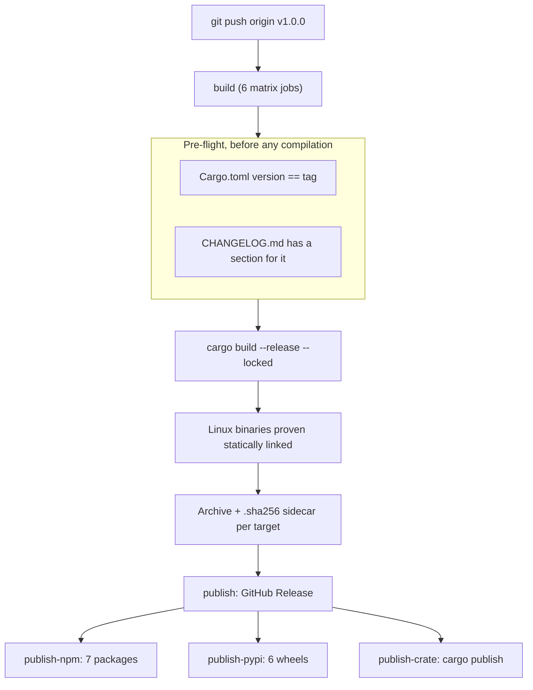

# 🚢 Releasing `dev-prune`

Everything needed to cut a release, and everything that has to exist on the outside
world for one to succeed. Written for a maintainer, not a user.

The short version: **a release is one `git push` of one tag.** Nothing is built,
uploaded, or published by hand. If a step below sounds like manual work, it is either
one-time setup or a pre-flight check.

---

## 📋 Contents

- [Launch day: the first release](#-launch-day-the-first-release)
- [The one-time setup](#-the-one-time-setup)
- [Cutting a release](#-cutting-a-release)
- [What the workflow does](#-what-the-workflow-does)
- [The changelog contract](#-the-changelog-contract)
- [Registry reference: who reviews what](#-registry-reference-who-reviews-what)
- [Why a Rust binary is welcome on npm and PyPI](#-why-a-rust-binary-is-welcome-on-npm-and-pypi)
- [Gated channels not yet wired up](#-gated-channels-not-yet-wired-up)
- [When a release goes wrong](#-when-a-release-goes-wrong)

---

## 🚀 Launch day: the first release

Every release after the first is [one tag push](#-cutting-a-release). The first one also
has to bring the outside world into existence. In order, because several steps depend on
the one above:

1. **Create the repository** as `Life-Experimentalist/dev-prune`, **public**. Public is
   not cosmetic: `npm publish --provenance` fails on a private repository, and the
   release check reads the public releases endpoint unauthenticated.

   ```bash
   gh repo create Life-Experimentalist/dev-prune --public --description "Reclaims disk space from idle Git repositories by deleting only what a lockfile can rebuild." --homepage "https://devprune.vkrishna04.me"
   ```

   Then set the topics, which are what GitHub search and the topic pages index on:

   ```bash
   gh repo edit Life-Experimentalist/dev-prune --add-topic rust,cli,developer-tools,disk-space,node-modules,monorepo,cleanup,devtools
   ```

   The social preview has no API and has to be uploaded by hand: Settings → General →
   Social preview → Upload `assets/banner.png`. It is the image every link to the
   repository renders as on Twitter/X, Slack, Discord and Hacker News, and without it
   they render as a grey octocat.

2. **Push `main`.** CI runs immediately — ten jobs, including `cargo package`, both
   packaging scripts against fabricated assets, the ARM64 Windows cross-check, and the
   changelog gate. Nothing below is worth doing until it is green.

   ```bash
   git remote add origin https://github.com/Life-Experimentalist/dev-prune.git && git push -u origin main
   ```
3. **Turn on Pages**: Settings → Pages → Source → **GitHub Actions**. Then point DNS at
   it — a `CNAME` record for `devprune` at `Life-Experimentalist.github.io` — and tick
   *Enforce HTTPS* once the certificate is issued. `site/public/CNAME` already carries
   the hostname, so nothing in the repository needs editing.

   Pages is off by default and the API says so plainly, which is a faster answer than
   waiting on DNS:

   ```powershell
   gh api repos/Life-Experimentalist/dev-prune/pages
   ```

   `HTTP 404` means Pages has never been enabled. Once it is, that returns the live URL
   and the certificate state.
4. **Prove the install scripts are actually served.** The one-liner in the README, the
   site and every doc points at this URL, and it is the single most-run command in the
   project:

   ```bash
   curl -fsSL https://devprune.vkrishna04.me/install.sh | head -5
   ```

5. **Add the credentials** — [npm](#npm), [PyPI](#pypi-trusted-publishing--no-token-anywhere)
   and [crates.io](#cratesio). Each channel needs a secret *and* its `*_PUBLISH`
   variable; a channel with neither is skipped, so a partial set is a valid way to
   start and the rest begin working on the next release with no code change.

   Confirm it rather than assuming it — this is the step whose omission is invisible
   until after the tag exists:

   ```powershell
   gh secret list; gh variable list
   ```

   You want `NPM_TOKEN` and `CARGO_REGISTRY_TOKEN` in the first list, and
   `NPM_PUBLISH`, `CRATES_PUBLISH` and `PYPI_PUBLISH` in the second. Empty output means
   nothing is configured, and the release will reach the GitHub release page only.
6. **Check the changelog date.** `CHANGELOG.md` dates the 1.0.0 section, and the date
   should be the day it actually ships. Fix it in place if the calendar has moved on.
7. **Read the release body before it becomes one.** This exact text is what appears on
   the GitHub release page:

   ```bash
   sh scripts/changelog-section.sh 1.0.0
   ```

   On Windows, `sh` is not on `PATH` but Git ships one, and running the real extractor
   beats reimplementing it — a second copy is a second thing to keep in step:

   ```powershell
   & "$env:ProgramFiles\Git\bin\sh.exe" scripts/changelog-section.sh 1.0.0
   ```

8. **Tag and push.**

   ```bash
   git tag -a v1.0.0 -m "v1.0.0" && git push origin v1.0.0
   ```

   PowerShell has no `&&`; use `;` and check in between, or just run the two separately.

9. **Verify each channel** once the workflow finishes. These are the four commands users
   will actually run, and running them is the only proof the packages resolve:

   ```bash
   npx dev-prune@1.0.0 -V
   uvx dev-prune@1.0.0 -V
   cargo install dev-prune --version 1.0.0
   curl -fsSL https://devprune.vkrishna04.me/install.sh | sh
   ```

   The last one is the shell installer. Its Windows counterpart is a different script and
   a different one-liner — `curl` in PowerShell is an alias for `Invoke-WebRequest` and
   will not behave like the binary, so verify the PowerShell path on PowerShell:

   ```powershell
   iwr -useb https://devprune.vkrishna04.me/install.ps1 | iex
   ```

Names are unclaimed on all three registries as of the check in
[Name availability](#name-availability) — but "unclaimed" has a shelf life, and the only
way to hold a name is to publish under it.

---

## 🔑 The one-time setup

Five channels publish automatically, and **each one is off until you switch it on**. A
channel that is off reports `skipped`, not `success` — so the run page tells you which
registries actually received the release, rather than looking identical either way.

Every channel needs **two** things: the credential, and a repository *variable* saying
the channel is configured. The variable exists because GitHub does not make the `secrets`
context available to a job-level `if:`, so a missing secret can only be detected inside
the job — by which point the job already exists and will report success when it returns
early. The variable is checked before the job starts.

Once the variable is `true`, a missing or mistyped secret **fails the release loudly**
instead of quietly skipping it.

| Channel | Credential | Variable to set | Off ⇒ |
|---|---|---|---|
| GitHub Release | `GITHUB_TOKEN` | — always runs | n/a |
| npm | `NPM_TOKEN` secret | `NPM_PUBLISH` = `true` | Job reports `skipped` |
| PyPI | *no secret* — Trusted Publishing | `PYPI_PUBLISH` = `true` | Job reports `skipped` |
| crates.io | `CARGO_REGISTRY_TOKEN` secret | `CRATES_PUBLISH` = `true` | Job reports `skipped` |
| GitHub Pages (site) | Automatic | — Settings → Pages → "GitHub Actions" | Site does not deploy |

Secrets and variables live in the same place, on two different tabs: **Settings → Secrets
and variables → Actions**. Putting a variable's value in the Secrets tab is the easiest
way to get a release that publishes nothing.

Whatever the outcome, the **What actually shipped** job writes a per-channel table to the
run summary, and warns if the release reached the GitHub release page and no registry.

### npm

1. Create an account on [npmjs.com](https://www.npmjs.com/) and enable 2FA.
2. Create a **Granular Access Token** (Access Tokens → Generate New Token → Granular).
   - Permissions: **Read and write** on packages.
   - Scope it to the seven package names below, or leave it account-wide before the
     first publish — granular tokens cannot name a package that does not exist yet.
   - Set an expiry you will actually remember. 90 days is the default; a year is fine
     for a personal project.
3. Save it as the repository secret **`NPM_TOKEN`**.
4. Set the repository **variable** **`NPM_PUBLISH`** to `true`. Without it the publish
   job does not run at all, and the release reports `skipped` for npm.

The seven packages the release publishes:

```
dev-prune                  ← the dispatcher everyone installs
dev-prune-linux-x64
dev-prune-linux-arm64
dev-prune-darwin-x64
dev-prune-darwin-arm64
dev-prune-win32-x64
dev-prune-win32-arm64
```

Nothing needs to be reserved in advance — the first publish creates all seven. The six
platform packages are published *before* the dispatcher, because npm resolves the
dispatcher's `optionalDependencies` as soon as it exists.

Publishes use `--provenance`, which requires the repository to be **public** and the
workflow to have `id-token: write`. It attaches a signed attestation tying each tarball
to this workflow, this commit and this tag; npm shows it as a green "Provenance" badge
on the package page. A private repo makes the publish fail — drop the `--provenance`
flag in that case.

### PyPI (Trusted Publishing — no token anywhere)

1. Create an account on [pypi.org](https://pypi.org/) and enable 2FA.
2. Go to **Your projects → Publishing → Add a new pending publisher** and fill in:

   | Field | Value |
   |---|---|
   | PyPI Project Name | `dev-prune` |
   | Owner | `Life-Experimentalist` |
   | Repository name | `dev-prune` |
   | Workflow name | `release.yml` |
   | Environment name | `pypi` |

   These four values are matched exactly against the OIDC token GitHub mints. The
   workflow filename and the `environment: pypi` block in `release.yml` are load-bearing
   — renaming either breaks publishing until PyPI is updated to match.
3. In the repository, create the environment: **Settings → Environments → New
   environment → `pypi`**. No secrets go in it. Add a required reviewer if you want a
   human approval gate before each PyPI upload.
4. Set the repository **variable** (not secret) **`PYPI_PUBLISH`** to `true`:
   Settings → Secrets and variables → Actions → Variables → New repository variable.

   The gate is a variable because Trusted Publishing has no secret to test for — without
   it, the job would hard-fail on every release until PyPI was configured.

### crates.io

1. Sign in at [crates.io](https://crates.io/) with GitHub.
2. Account Settings → API Tokens → New Token. Scopes: `publish-new` and `publish-update`.
3. Save it as the repository secret **`CARGO_REGISTRY_TOKEN`**.
4. Set the repository **variable** **`CRATES_PUBLISH`** to `true`.

### Name availability

Checked on 2026-08-12. All three names are unclaimed on all three registries:

| Name | npm | PyPI | crates.io |
|---|---|---|---|
| `dev-prune` | free | free | free |
| `devp` | free | free | free |
| `devprune` | free | free | free |

`Cargo.toml`, `npm/package.json` and `scripts/build_wheels.py` all publish as
**`dev-prune`**. Registering `devp` and `devprune` as placeholders is optional; npm and
PyPI both discourage name-squatting, and neither has a redirect mechanism, so a
placeholder is only worth it if you intend to publish something real under it.

---

## 🏷️ Cutting a release

```bash
cargo fmt --all -- --check && cargo clippy --all-targets --all-features -- -D warnings && cargo test --all
```

CI runs all of this on every push, so the only reason to run it locally is to avoid
tagging something that will fail.

Then:

1. **Bump the version** in `Cargo.toml`. Run `cargo build` so `Cargo.lock` picks it up —
   the release builds with `--locked` and will fail on a stale lockfile.
2. **Write the changelog entry.** See [the changelog contract](#-the-changelog-contract).
   CI fails if `CHANGELOG.md` has no section matching the version in `Cargo.toml`, so
   this is enforced, not merely encouraged.
3. **Commit and push to `main`.** Wait for CI to go green.
4. **Tag and push the tag:**

   ```bash
   git tag -a v1.0.0 -m "v1.0.0"
   git push origin v1.0.0
   ```

That is the release. A tag matching `v*` triggers everything below.

To re-run a release after fixing a failed job, use **Actions → Release → Run workflow**
and enter the tag. The npm job skips packages already on the registry, so a re-run
finishes what the first attempt started rather than dying on a conflict.

---

## ⚙️ What the workflow does



**`build`** — six targets, `fail-fast: false` so one broken platform does not hide the
others:

| Target | Asset |
|---|---|
| `x86_64-unknown-linux-musl` | `dev-prune-v<ver>-linux-x64.tar.gz` |
| `aarch64-unknown-linux-musl` | `dev-prune-v<ver>-linux-arm64.tar.gz` |
| `x86_64-apple-darwin` | `dev-prune-v<ver>-darwin-x64.tar.gz` |
| `aarch64-apple-darwin` | `dev-prune-v<ver>-darwin-arm64.tar.gz` |
| `x86_64-pc-windows-msvc` | `dev-prune-v<ver>-windows-x64.zip` |
| `aarch64-pc-windows-msvc` | `dev-prune-v<ver>-windows-arm64.zip` |

Every asset gets a `.sha256` sidecar in `sha256sum` format. **The install scripts refuse
to install without it**, so the sidecars are a contract, not a courtesy — as are the
asset names themselves, which `scripts/install.sh` and `scripts/install.ps1` construct
by hand.

Linux is musl and statically linked on purpose. A glibc build carries a floor: it
refuses to start on any distribution older than the runner that produced it, and does
not run on Alpine at all. A static binary has neither problem, so one asset per
architecture covers every distribution. The workflow proves the result is actually
static with `file` before packaging it, because a silently-dynamic binary would work on
the runner and fail only for users.

**`publish`** — attaches every asset to a GitHub Release whose body is the changelog
section for that version, with the auto-generated commit list appended below it.

**`publish-npm`** — `scripts/npm-prepare.sh` unpacks the assets into the seven packages
and publishes them, platform packages first. Prereleases (any tag containing `-`) go out
under the `next` dist-tag so they never become what `npm install dev-prune` resolves to.

**`publish-pypi`** — `scripts/build_wheels.py` turns the same assets into six wheels and
uploads them via Trusted Publishing.

**`publish-crate`** — `cargo publish --locked`. Skipped for prereleases, because a
crates.io version can never be deleted, only yanked.

Both packaging scripts are exercised by the `packaging` job in CI on every push, against
fabricated assets. Their first real run is therefore not their first run.

The same reasoning covers `aarch64-pc-windows-msvc`, the only release target that is not
a native build on its own runner. CI's `cross` job type-checks it on every push, so the
ARM64 Windows toolchain and `ring`'s native code are known to work before a tag exists
rather than after.

---

## 📝 The changelog contract

`CHANGELOG.md` is the single source for release notes.
`scripts/changelog-section.sh <version>` extracts one version's section, and it is
called from three places: CI (on every push), the release build (before compiling), and
the release publish (as the release body). A release note and a changelog entry that can
drift apart eventually do — this makes them the same text.

The format is [Keep a Changelog](https://keepachangelog.com/) with
[SemVer](https://semver.org/):

```markdown
## [1.1.0] - 2026-09-01

### Added

- `devp run --except <name>` prunes everything **but** the repositories you name. …

### Fixed

- `devp unlink --missing` now also clears the undo list. …
```

Rules the automation depends on:

- The heading is exactly `## [<version>] - <YYYY-MM-DD>`. The extractor matches
  `## [<version>]` as a literal string prefix, so `1.0.0` will not accidentally match
  `1.0.0-rc1`.
- A section ends at the next `## ` heading. Anything between belongs to that version.
- The version must equal the one in `Cargo.toml` by the time you tag.
- Subsections use `### Added` / `### Changed` / `### Fixed` / `### Removed`.

House style for the entries themselves is in [`../CLAUDE.md`](../CLAUDE.md).

Verify a section renders the way you expect before tagging:

```bash
sh scripts/changelog-section.sh 1.1.0
```

---

## 🏛️ Registry reference: who reviews what

A common assumption is that publishing to a package registry involves review. For the
three registries used here, it does not.

| Registry | Human review? | What actually happens |
|---|---|---|
| **npm** | **None.** | `npm publish` makes the version live in seconds. Automated malware scanning runs after the fact and can result in takedown, not a hold. |
| **PyPI** | **None.** | Same: live immediately. Automated checks reject malformed metadata and oversized files; no person looks at the code. |
| **crates.io** | **None.** | Same. Publishing is permanent — a version can be *yanked* (hidden from resolution) but never deleted, and the name is never released. |
| **Homebrew core** | **Yes.** | A PR to `homebrew-core` reviewed by maintainers, with notability requirements (roughly 30+ forks / 30+ watchers / 75+ stars, or a clear equivalent). A **personal tap** has no review at all. |
| **WinGet** | **Yes.** | A PR to `microsoft/winget-pkgs`. Largely automated validation plus a maintainer sign-off; installer URL and hash must match. |
| **Scoop** | Depends. | The `extras` bucket is a reviewed PR; your own bucket is not. |
| **Chocolatey** | **Yes.** | Moderation queue, both automated and human. Historically the slowest of the lot. |
| **AUR** | **None.** | Anyone with an account can upload a PKGBUILD. |

So: npm, PyPI and crates.io are effectively free-for-all — the only gate is owning the
name, and [all three names are free](#name-availability). Publish early to hold them.

The flip side of "no review" is that **nothing is reversible**. crates.io versions are
permanent; npm allows unpublishing only within 72 hours and only if nothing depends on
the package; PyPI lets you delete a release but never reuse that version number. This is
why every publish job is gated behind a successful build of all six platforms, and why
the version/changelog checks run *before* compilation rather than after.

---

## 🦀 Why a Rust binary is welcome on npm and PyPI

Neither registry requires the package to contain JavaScript or Python. Both are, in
practice, general-purpose binary distribution networks with excellent CDNs, and shipping
a compiled CLI through them is a mainstream pattern rather than an abuse of one.

**On npm**, the mechanism is `optionalDependencies` plus the `os` and `cpu` manifest
fields. A thin dispatcher package lists one package per platform; npm evaluates `os`/`cpu`
during resolution, installs the single package that matches the machine, and skips the
other five without an error. The dispatcher's `bin` entry is a ~40-line Node launcher
that `require.resolve`s the real executable and `spawn`s it.

This is what **esbuild**, **Biome**, **SWC**, **Turborepo**, **Prisma** and **Tailwind's
Oxide engine** all do — none of them are JavaScript at the core either.

The alternative — a `postinstall` script that downloads a binary — is what dev-prune
deliberately does *not* do. It breaks `npm ci --ignore-scripts`, breaks offline and
air-gapped installs, breaks every corporate registry mirror, and turns a dependency
install into an outbound network call to GitHub. Shipping the bytes in the tarball has
none of those failure modes.

**On PyPI**, the mechanism is a platform wheel. A wheel is a zip with a metadata
directory; files placed in `<name>-<version>.data/scripts/` are unpacked straight into
the environment's `bin`/`Scripts` directory at install time. No Python is executed, no
compiler is involved, and no build backend is needed. The wheel's platform tag
(`manylinux_2_17_x86_64`, `win_amd64`, `macosx_11_0_arm64`, …) is what makes pip and uv
select the right one.

The definitive proof that this is normal: **`uv` itself is a Rust binary distributed as
PyPI wheels**, and so is **`ruff`**. `pip install uv` downloads a Rust executable.

`scripts/build_wheels.py` tags the Linux wheels as *both* manylinux and musllinux from
the same asset. That is legitimate rather than a trick — the manylinux policy is a
ceiling on which shared libraries a wheel may require, and a statically linked binary
requires none, so it satisfies the policy trivially while also being the literal
musllinux case. One build serves Debian and Alpine users alike.

What this buys, concretely:

```bash
uv tool install dev-prune     # persistent install, no Python project needed
uvx dev-prune status          # run once, nothing left behind
pipx run dev-prune status     # same, via pipx
npx dev-prune status          # same, via npm
```

---

## 🚧 Gated channels not yet wired up

These need a human on the other side, so none of them are in `release.yml`. Each becomes
worth doing at a different point.

**Homebrew.** A personal tap (`Life-Experimentalist/homebrew-tap`) works today and needs
no review: a repository containing a `Formula/dev-prune.rb` that points at the darwin
and linux assets and their sha256 sums, giving
`brew install Life-Experimentalist/tap/dev-prune`. Getting into `homebrew-core` — plain
`brew install dev-prune` — requires meeting the notability bar, so it is a
post-popularity step, not a launch step. Automating the tap bump is straightforward once
the tap exists: an extra release job that rewrites the formula's `url` and `sha256`.

**WinGet.** A PR to `microsoft/winget-pkgs` containing a manifest that points at the
Windows `.zip` assets and their hashes. `wingetcreate update` generates and submits it,
and can run from the release workflow with a PAT. Worth doing once the download URLs
have been stable for a release or two — a rejected manifest is a manual round trip.

**Scoop.** A personal bucket, same shape as the Homebrew tap and same lack of review.

**Chocolatey.** Its moderation queue is slow enough that it is only worth it if Windows
users ask for it specifically; WinGet covers the same audience with less friction.

**Linux distribution packages** (apt/dnf/AUR). The static musl binary means a `.deb` or
`.rpm` would be trivial to build, but they need a signed repository to be worth
installing from. The one-line installer covers the same ground until someone asks.

---

## 🔥 When a release goes wrong

**A build job failed.** Nothing was published — `publish` needs all six. Fix, then either
delete and re-push the tag (safe only if nobody has fetched it) or re-run the workflow
via Actions with the same tag.

**A publish job failed after another succeeded.** Re-run the workflow with the same tag.
The npm job skips what is already on the registry; `cargo publish` will fail on an
already-published version, which is loud and harmless.

**The tag is wrong.** If nobody has fetched it:

```bash
git tag -d v1.0.0 && git push origin :refs/tags/v1.0.0
```

If anyone might have, cut a new patch version instead. A moved tag is a genuinely nasty
failure for anyone who already pulled it.

**A bad version reached crates.io.** `cargo yank --version 1.0.0` stops new dependents
from resolving it. It cannot be deleted, and the version number cannot be reused. Publish
a fixed patch version.

**A bad version reached npm.** `npm unpublish dev-prune@1.0.0` works within 72 hours if
nothing depends on it. Otherwise `npm deprecate dev-prune@1.0.0 "reason"` and publish a
patch. Remember the six platform packages need the same treatment.

**A bad version reached PyPI.** Delete the release from the project page. The version
number is burned permanently — publish a patch.

---

## 🔗 See also

- [Multi-Ecosystem Distribution & Packaging Manual](DISTRIBUTION.md) — the user-facing
  view of every install channel
- [GitHub Releases, DIY Manual Install & Source Build](RELEASES_AND_MANUAL_INSTALL.md)
- [`../CONTRIBUTING.md`](../CONTRIBUTING.md) — development setup and the local gate
- [`../CLAUDE.md`](../CLAUDE.md) — repository conventions, including changelog voice
