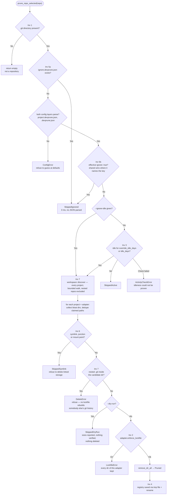
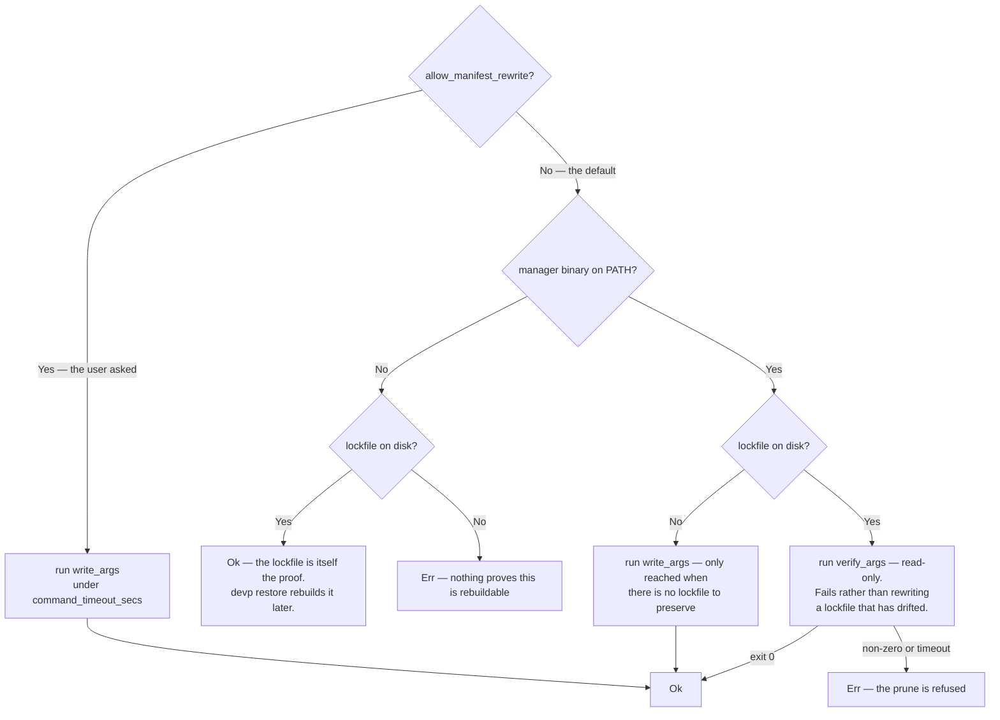

# 🛡️ Safety Invariants & Risk Mitigation in `dev-prune`

`dev-prune` (`devp`) is built on a strict **"Safety First"** philosophy. Deleting files is high-risk, so the engine enforces seven independent validation layers before any directory is removed. Every one of them is a refusal: when a check cannot be satisfied, nothing is deleted and the reason is printed.

---

<p align="center">
  
</p>

---

## 🛡️ Safety Invariant Flowchart

The order below is the order the checks actually run in
[`prune_repo_selected`](../src/engine.rs). Every diamond that exits sideways returns a
`PruneResult` describing the refusal — the pass never stops silently.



*Figure 1: the refusal ladder, in execution order.*

Two things this diagram makes explicit that prose tends to hide:

- **`--dry-run` verifies nothing.** It reports sizes and stops before
  `enforce_lockfile`, which is why a dry run is instant and never touches a lockfile.
  A directory listed by `--dry-run` is not yet proven deletable.
- **`--ignore-idle` skips the idle check only.** It re-enters the same pipeline at the
  discovery step; lockfile verification and the symlink refusal still stand. It was
  called `--force` before 1.0.0 and was renamed for exactly this reason: the old name
  claimed a power the flag never had. That spelling is still accepted and prints a note.

---

## 🛡️ Detailed Safety Invariants

### 1. Mandatory `.git` Directory Boundary Guard
`dev-prune` **NEVER** processes or deletes files in any directory that does not contain a `.git` entry at its root:
```rust
pub fn is_git_repo(path: &Path) -> bool {
    let dot_git = path.join(".git");
    dot_git.is_dir() || dot_git.is_file()
}
```
If a folder lacks `.git`, it is completely ignored, protecting arbitrary user home directories, system folders, or downloads from accidental cleanup.

`.git` is a **directory** in a normal clone but a **file** containing a `gitdir:`
pointer in linked worktrees (`git worktree add`) and submodule checkouts. The check
deliberately accepts both, so a worktree or submodule checkout can be registered and
pruned **as a repository in its own right** — otherwise every worktree and submodule on
the machine would be silently ignored. Nothing else is loosened for them: idleness is
measured in that checkout (its commits and its source `mtime`s), lockfile
pre-verification still has to pass, and only that checkout's own bloat directories are
candidates. What the boundary guards against is unchanged — a directory with no `.git`
entry at all is never touched.

---

### 2. Two-Tier Lockfile Pre-Verification
Before deleting any directory an adapter claims, the project's package manager must
confirm that the directory is rebuildable. Verification runs under a configurable timeout
(`command_timeout_secs`) and cannot be bypassed — not by `--ignore-idle`, not by any
setting. `allow_manifest_rewrite` is not an exception: it changes *which* command an
adapter is allowed to run, never whether the check happens. A directory no adapter claims
is reachable only by declaration, which is checked on its own terms — see invariant 5.

- **Tier 1 (binary installed)**: the manager resolves the manifest against the lockfile.
- **Tier 2 (binary missing, lockfile present)**: an on-disk lockfile is itself the proof
  of recoverability, so deletion proceeds — `devp restore` can rebuild the tree once the
  manager is installed again.
- **Abort**: verification failed *and* there is no lockfile. Nothing is deleted, and the
  command to fix it is printed.

Every adapter reaches this gate through one shared helper, `enforce_two_tier` in
[`src/adapters/mod.rs`](../src/adapters/mod.rs). It takes two command forms per
ecosystem — a read-only one and a writing one — and picks between them by the rule
below.



*Figure 2: `enforce_two_tier`, the one shape every adapter follows. Tier 2 — the "binary
missing, lockfile present" path — is the same in all of them.*

Some adapters sit outside it:

- **yarn** runs the shape, then downgrades a failure to `Ok` when `yarn.lock` exists. It
  only errors when verification failed *and* there is no lockfile, because
  `--mode update-lockfile` is a Berry flag that Yarn Classic rejects outright.
- **venv** runs no command at all. Its check is pure inspection: `requirements.txt`
  must exist and list at least one non-comment package, and every distribution
  installed in the environment (read from its `site-packages` `*.dist-info` metadata)
  must be reachable from something the file pins — directly, or as a transitive
  dependency of a pinned package. A `pip install foo` that was never written back is
  recoverable from nowhere, so the prune refuses, names the unrecorded packages, and
  suggests `pip freeze > requirements.txt`. One package is named by hand: when the sole
  unaccounted distribution is dev-prune itself, the message says so and offers
  `pip uninstall` and `uv tool install` alongside `pip freeze`, because a tool that ended
  up inside a project's environment is a different accident from a dependency somebody
  forgot to record. That changes which repair is suggested and nothing else — the
  refusal is identical, nothing is deleted, and there is no flag that relaxes it. A file
  that cannot be fully parsed (editable installs, bare URLs, unreadable includes) skips
  the comparison rather than guessing in either direction. Projects carrying
  `poetry.lock`, `Pipfile.lock`, `pdm.lock` or a `[tool.poetry]` table are not claimed
  at all: their `requirements.txt` is usually a stale export of the real lockfile, and
  rebuilding from it would quietly produce a different environment than the one deleted.
- **cocoapods, mix, gradle, maven** and **swift** run no command either, for a
  different reason: their ecosystems have no read-only "is this in sync?" verb.
  `pod install`, `mix deps.get` and `gradle --write-locks` all *fix* drift by
  rewriting the lockfile and re-downloading — a write and a network round trip in the
  middle of a delete pass. So the proof is offline instead: the lockfile is
  structurally complete and no older than the manifest it came from (cocoapods, mix),
  or the manifest that `build/`, `target/` and `.build/` are entirely derived from is
  present and parses (gradle, maven, swift).

The verification command per ecosystem, and the writing form it refuses to run for you:

| Ecosystem | Verification (default)                                     | Writes? | Writing form, on `allow_manifest_rewrite` or a missing lockfile |
| :-------- | :--------------------------------------------------------- | :------ | :--- |
| npm       | `npm ci --dry-run --ignore-scripts`                        | no      | `npm install --package-lock-only --ignore-scripts` |
| pnpm      | `pnpm install --lockfile-only --frozen-lockfile`           | no      | `pnpm install --lockfile-only` |
| yarn      | `yarn install --immutable --mode update-lockfile`          | no      | `yarn install --mode update-lockfile` |
| bun       | `bun install --frozen-lockfile --dry-run --ignore-scripts` | no      | *(none — bun's natural check is already read-only)* |
| uv        | `uv lock --locked`                                         | no      | `uv lock` |
| poetry    | `poetry check --lock`, plus no installed package the lockfile never recorded | no      | `poetry lock` |
| pdm       | `pdm lock --check`                                         | no      | `pdm lock` |
| pipenv    | `pipenv verify`                                            | no      | `pipenv lock` |
| venv      | `requirements.txt` lists ≥1 package; no installed package is unrecorded | no      | *(none — nothing is executed)* |
| cargo     | `cargo metadata --locked --format-version 1`               | no      | `cargo generate-lockfile` |
| go        | `go mod download`                                          | no      | `go mod tidy` |
| composer  | `composer validate --no-check-publish --no-check-all`       | no      | `composer update --no-install` |
| bundler   | `bundle lock --check`                                      | no      | `bundle lock` |
| cocoapods | `Podfile.lock` has a `SPEC CHECKSUMS` section and is no older than the `Podfile` | no      | *(none — nothing is executed)* |
| mix       | `mix.lock` is a complete Elixir map and no older than `mix.exs` | no      | *(none — nothing is executed)* |
| gradle    | a Gradle manifest is present and readable                  | no      | *(none — nothing is executed)* |
| maven     | `pom.xml` contains a `<project` element                     | no      | *(none — nothing is executed)* |
| swift     | `Package.swift` declares a `Package(`                      | no      | *(none — nothing is executed)* |

The rule behind that table: **verification never writes, and a lockfile that has drifted
from its manifest is a refusal, not something to quietly fix.** A stale lockfile cannot
rebuild the tree we are about to delete, which is the one thing this page promises.

Some consequences worth spelling out:

- **The default is refusal even when the fix is trivial.** `npm install
  --package-lock-only` would repair a drifted `package-lock.json` in a second. It is
  still not run, because a prune pass can be started by the OS scheduler while nobody is
  watching, and a background process that leaves a modified tracked file behind is a
  surprise regardless of how small the edit was. `devp config set allow_manifest_rewrite
  true` is the informed opt-in, and it now means the same thing in every ecosystem —
  before 1.0.0 it was consulted by cargo and go only, while the other four rewrote their
  lockfiles unconditionally.
- **bun verifies with `--dry-run`.** A plain `bun install --frozen-lockfile` is a real
  install: it downloads every dependency and runs their lifecycle scripts. Executing
  third-party code in order to delete the tree it just built is not verification.
- **Yarn Classic is verified by lockfile presence.** `--mode update-lockfile` is a Yarn
  Berry flag. Classic has no resolve-only mode, and its nearest equivalent performs a
  full install with lifecycle scripts, so on Classic an existing `yarn.lock` is what is
  required.
- **Every one of these runs under `command_timeout_secs`** (default 600). A manager that
  hangs on a slow network fails the verification and the directory survives.

---

### 3. Hybrid Inactivity Solver (`git log` + Source File `mtime`)
To prevent deleting build artifacts in active projects where a developer has uncommitted local work:
1. `dev-prune` queries `git log -1 --format=%ct` for last commit timestamp.
2. It walks the source directory tree scanning source file `mtime` modification timestamps (excluding bloat dirs and `.git`).
3. It computes `max(last_commit_time, latest_source_mtime)`.
If the activity timestamp is less than `idle_days` old (default 15 days), the project is considered **Active** and protected.

---

### 4. Atomic Registry State Persistence
All mutations to `~/.config/dev-prune/registry.json` write to a temporary file named
per-process (`registry.json.<pid>.tmp`) before calling OS filesystem rename:
```rust
let tmp_path = path.with_extension(format!("json.{}.tmp", std::process::id()));
std::fs::write(&tmp_path, &contents)?;
std::fs::rename(&tmp_path, path)?;
```
The temp name carries the process id because a manual run and the scheduled daemon pass
can save at the same moment — with one shared `registry.json.tmp`, one process could
rename the other's half-written file into place as a torn, unparseable registry.

The registry is therefore never edited in place. A write that is interrupted — crash,
reboot, full disk — leaves the previous `registry.json` untouched, and at worst an
orphaned per-PID `.tmp` file. That file is a partial write, not a backup; nothing reads
it back, and it is safe to delete.

---

### 5. Fast 0ms `ignore.devprune.json` & Per-Repo Settings
- **`ignore.devprune.json`**: File presence check running in **0ms O(1) latency** bypassing directory iteration without reading or parsing JSON file contents.
- **`.devprune.json`**: Per-repository configuration supporting `project_name`, `ignore`, `disable_daemon` (excluded from the scheduled pass only), `disable_hooks` (the global Git hook will not auto-register this repo), and the three tuning overrides `override_idle_days`, `min_size_mb` and `scan_depth`. Automatically recorded in the repository's `.git/info/exclude` when created, so it never shows up in `git status` and the shared `.gitignore` is never touched.
- **`project.devprune.json`**: the same keys and the same schema, meant to be committed. Written only by `devp config project <PATH> --team`, never by a `--fix`, a hook or a toggle. Every key it names wins over `.devprune.json`; every key it leaves out, `.devprune.json` still answers.
- **`prunable.directories`** in either file names directories no adapter can recognise, each with the `rebuild` command that puts it back. Because the committed file arrives in a clone, a declaration is checked rather than obeyed: the path must be relative with no `..`, must resolve inside the repository even through a symlinked parent, must hold no Git-tracked file, and the first word of `rebuild` must be a program this machine has. A declaration that fails any of those is reported and nothing is deleted. This is the only mechanism by which dev-prune deletes a directory no adapter claimed, and it has no bypass either.

Either file failing to parse is treated as a refusal to guess, not as a missing file: the
repository is skipped and the syntax error is printed, naming which of the two it was.
Falling back to defaults would silently discard whatever the file said — including the
`"ignore": true` that was the whole reason it existed — and prune a repository that had
opted out. Only the personal file is ever repaired by `devp doctor --fix`, and only by
renaming the broken one aside; a file the user has committed is theirs to fix.

Both hold **inert data only** — flags, a number, a display name. Nothing in either can
name a command, a path to delete, or a directory to add. The shared one is why the rule
has teeth: it arrives with a `git clone`, from whoever wrote the repository. Cloning an
untrusted repository and running `devp` on it must not be a way to execute anything, so
the settings that widen what a pass may do — `allow_manifest_rewrite`,
`require_confirmation`, every `enable_*` build-tree switch — have no per-repository form
at all, in either file.

---

### 6. Symlink, Junction and Mount-Point Refusal
A bloat directory that is a symlink or a Windows junction points at storage the
repository does not own — in a monorepo it is typically the workspace root's real
`node_modules`. Deleting it recursively would reach outside the repository, so
`dev-prune` refuses and says so, rather than following the link:

```rust
if fs::symlink_metadata(&path).map(|m| m.file_type().is_symlink()).unwrap_or(false) {
    // reported as SkippedSymlink, never removed
}
```

The same refusal covers **mount points**, which are the case a link check alone misses.
A container's `-v shared_modules:/app/node_modules`, an NFS export, or a bind mount
aiming two checkouts at one cache all leave an ordinary-looking directory whose storage
is shared with somebody else — and, unlike a link, there is nothing to remove but the
mount itself. On Unix the directory's device id is compared with its parent's; a
mismatch means something is mounted there and it is left alone. Windows expresses the
same thing as a reparse point, which the check above already catches.

The directory walk itself also runs with `follow_links(false)`, so no linked tree is
ever traversed, sized, or counted.

---

### 7. Nested Repository Boundary
A repository may contain several projects at several depths, and each is discovered,
verified and pruned on its own terms. That walk is bounded so it can never leave the
repository it was asked about or wander into dependency trees:

- **Depth cap of `scan_depth` levels** below the repository root — six by default,
  configurable globally and per repository. `config set` accepts `1`–`32` and rejects
  anything outside that range; the clamp to the same range survives only as the
  backstop for a hand-edited config file.
- **Never descends into** `node_modules`, `target`, `vendor`, `bower_components`, any
  directory containing `pyvenv.cfg`, or any hidden directory.
- **Never descends into a nested repository.** A directory containing its own `.git` is
  a submodule or a vendored checkout with its own history and its own idle state. It is
  pruned only when registered and pruned in its own right, never as part of its parent.

The `node_modules` exclusion is a correctness invariant as well as a performance one: a
dependency tree contains thousands of `package.json` files, and treating any of them as
a project would mean verifying and deleting inside somebody else's package.
