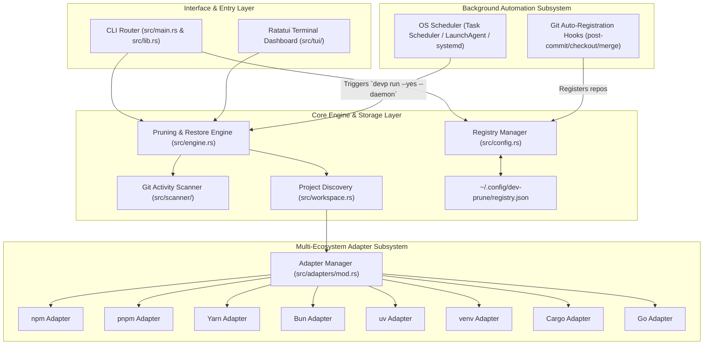
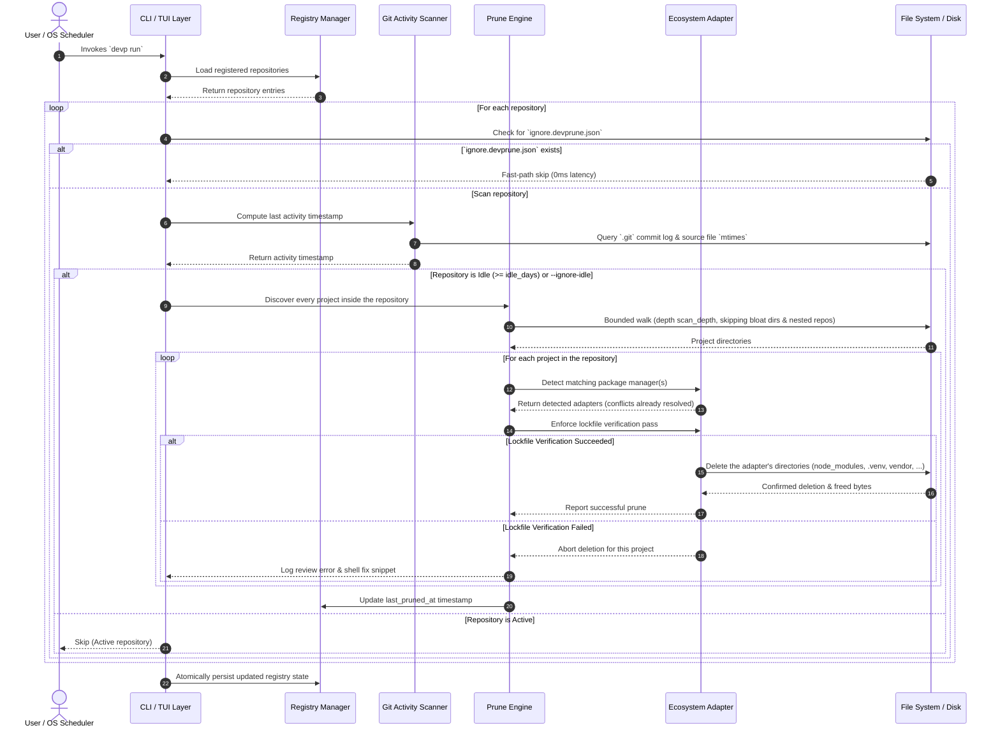

# High-Level Technical Design Specification (HLD): `dev-prune`

This document defines the High-Level Design (HLD) specification for **`dev-prune`** (`devp`), a universal, lockfile-safe workspace maintenance CLI and background automation tool written in Rust (edition 2024).

---

  

---

## 🏛️ 1. Executive System Architecture

`dev-prune` is architected as a modular, multi-layered CLI application. It acts as an automated workspace maintenance layer between developer filesystem repositories, multi-ecosystem package managers, and operating system background schedulers.

*Figure 1: High-Level System Architecture and Layer Interactions.*

#### Diagram Description & Element Breakdown
- **CLI**: Argument parsing, flag evaluation, binary alias handling (`dev-prune` and `devp`).
- **TUI**: Interactive Ratatui interface displaying space metrics, repository status, and inline actions.
- **RegistryManager**: Serde-backed registry reader/writer with atomic file swap protection.
- **Engine**: Orchestrates repository scanning, inactivity calculations, pre-deletion checks, and dependency restoration.
- **GitScanner**: Evaluates `.git` commit timestamps (`git log`) and fallback file modification timestamps (`mtime`).
- **Workspace**: Bounded walk of a registered repository that finds every package-manager project inside it, at any depth, so a monorepo's `frontend/`, `services/api/` and `cli/` are each handled on their own terms.
- **GlobalConfig**: Persistent JSON storage at `~/.config/dev-prune/registry.json` (or `%APPDATA%\dev-prune\registry.json`).
- **AdapterRegistry**: Interface managing concrete ecosystem package manager implementations.
- **The adapters**: Twenty-three of them, one per package manager, each enforcing lockfile safety and owning that ecosystem's directories. JavaScript (npm, pnpm, Yarn, Bun), Python (uv, Poetry, PDM, Pipenv, venv), Rust (Cargo), Go, PHP (Composer), Ruby (Bundler), Elixir (Mix, and Mix builds), Apple (CocoaPods, SwiftPM), Dart, Infrastructure (Terraform), JVM (Gradle, Maven) and C/C++ (vcpkg, CMake builds). Eight are opt-in; the list is in [`docs/CLI_REFERENCE.md`](../CLI_REFERENCE.md).
- **OSDaemon**: Native background task triggering periodic 2-day automated maintenance passes.
- **GitHooks**: Non-blocking background shell hooks registering newly checked-out Git repositories.

---

## 🔄 2. Data Flow & Execution Sequence

*Figure 2: Complete Execution Lifecycle Sequence.*

#### Diagram Description & Element Breakdown
1. **Invokes `devp run`**: User or OS background scheduler triggers execution pass.
2. **Load registered repositories**: Registry Manager loads `~/.config/dev-prune/registry.json`.
3. **Fast-path skip**: Immediate 0ms skip if `ignore.devprune.json` is present in workspace root.
4. **Compute last activity timestamp**: Scanner checks `git log -1 %ct` and source file `mtime` modification timestamps. Activity is measured for the repository as a whole, so an actively-developed monorepo protects all of its projects.
5. **Discover every project**: Bounded walk of the repository returning each directory an adapter applies to; every one is then verified and pruned independently.
6. **Enforce lockfile verification**: Executes lockfile verification CLI command with timeout guard.
7. **Delete bloat directories**: Safe removal of target bloat directories upon successful lockfile verification.
8. **Abort deletion**: Immediately aborts deletion if lockfile verification fails, preserving workspace safety. One project aborting never stops the others.
9. **Atomically persist**: Atomically writes updated state to `registry.json`.

---

## 🎯 3. System Boundaries & Guarantees

> [!IMPORTANT]
> **Git Repository Boundary Guarantee**: Operations are strictly restricted to folders containing a valid `.git` root. Non-Git folders are ignored.

> [!NOTE]
> **Two-Tier Lockfile Pre-Verification**: Before deleting any directory an adapter claims (`node_modules`, `.venv`, `vendor`, `Pods` and the rest), `dev-prune` verifies that ecosystem's lockfile (`package-lock.json`, `pnpm-lock.yaml`, `uv.lock`, `Cargo.lock`, `go.sum`, `composer.lock`, `Gemfile.lock`, `mix.lock` — one per adapter).

> [!NOTE]
> **Any Number of Ecosystems per Repository**: A registered repository may hold any number of projects, in any combination — three managers side by side in the root, one per subtree, or both at once. Each is detected, verified, pruned and restored independently. The discovery walk never leaves the repository, never enters a dependency tree, and never crosses into a nested `.git`.

> [!TIP]
> **Privacy**: `dev-prune` collects no analytics, diagnostics or usage data. The only network request it makes is a release check against GitHub's public API — no body, no identifier, at most weekly, and switched off by `devp config set update_check false`. See [PRIVACY.md](../PRIVACY.md).
