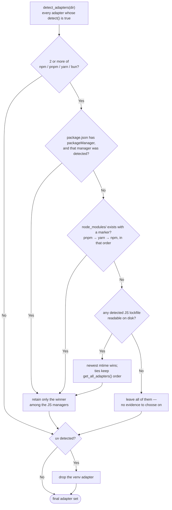
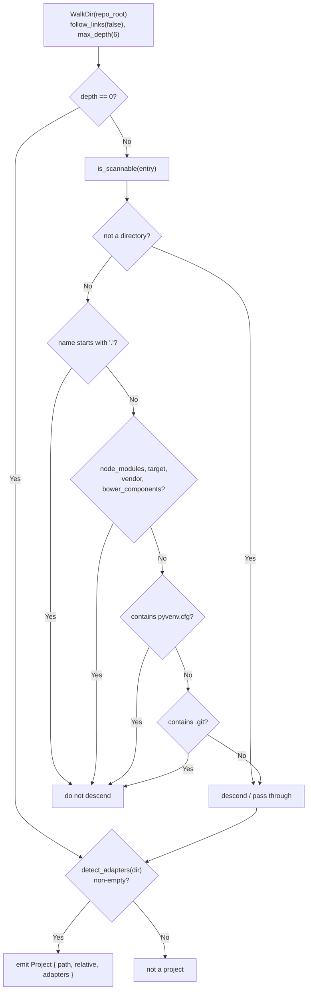

# Low-Level Technical Design Specification (LLD): `dev-prune`

This document defines the Low-Level Design (LLD) specification for **`dev-prune`** (`devp`), detailing crate module layouts, data schemas, trait contracts, atomic algorithms, and path resolution mechanics.

---

## 🔬 1. Crate Module Map & Visibility

```
src/
├── main.rs                 # Executable entry point delegating to dev_prune::run_cli()
├── lib.rs                  # Primary library root, CLI Clap parser, subcommands & normalizer
├── config.rs               # Registry struct, Settings struct, RepoEntry & atomic I/O
├── engine.rs               # Core pruning coordinator, restore executor & space metrics
├── constants.rs            # Application version, default paths, timeouts & file names
├── output.rs               # Terminal styling, banners, human-readable byte formats & shell fix formatters
├── workspace.rs            # Bounded intra-repository project discovery (monorepo support)
├── commands/               # One module per CLI subcommand
│   ├── mod.rs              # Subcommand router
│   ├── init.rs             # Bulk repository registration
│   ├── link.rs             # Single-repository registration (also used by the Git hook)
│   ├── run.rs              # Prune execution & interactive selection entry point
│   ├── status.rs           # Registry summary & TUI dashboard entry point
│   ├── restore.rs          # Dependency restoration
│   ├── undo.rs             # Last-run reversal
│   ├── config.rs           # Settings, per-repo config & daemon/icon subcommands
│   ├── daemon.rs           # Scheduler enable/disable/status
│   ├── hook.rs             # Global Git hook install/uninstall/status
│   ├── icon.rs             # Icon & JSON Schema registration
│   ├── skill.rs            # Agent skill file emission
│   ├── update.rs           # Self-update check
│   └── uninstall.rs        # Full removal of installed state
├── scanner/                # Git repository discovery & activity solver
│   ├── mod.rs              # Directory walker & git repository validator
│   └── git.rs              # Git commit log parser & mtime fallback scanner
├── adapters/               # Multi-ecosystem package manager adapters
│   ├── mod.rs              # PackageManager trait, BloatDir struct & lockfile helpers
│   ├── npm.rs              # npm lockfile enforcement & restore
│   ├── pnpm.rs             # pnpm lockfile enforcement & restore
│   ├── yarn.rs             # yarn lockfile enforcement & restore
│   ├── bun.rs              # bun lockfile enforcement & restore
│   ├── uv.rs               # uv lockfile enforcement & restore
│   ├── venv.rs             # standard Python venv restore & detection
│   ├── cargo_adapter.rs    # Rust Cargo target/ cleanup & lockfile guard
│   └── go.rs               # Go mod vendor/ cleanup & go.sum sync
├── daemon/                 # Cross-platform background scheduling
│   ├── mod.rs              # Scheduler router & status inspector
│   ├── windows.rs          # Windows Task Scheduler (schtasks) integration
│   ├── macos.rs            # macOS LaunchAgent (plist) integration
│   └── linux.rs            # Linux systemd user service & timer integration
└── tui/                    # Terminal Dashboard UI
    ├── mod.rs              # TUI submodule root
    ├── selection_view.rs      # Interactive pruning candidate selection view
    └── status_view.rs      # Ratatui dashboard renderer & keyboard listener
```

---

## 💾 2. Data Schemas & Persistence Contracts

### 2.1 Global Registry Schema (`~/.config/dev-prune/registry.json` / `%APPDATA%\dev-prune\registry.json`)

```rust
#[derive(Debug, Clone, Serialize, Deserialize)]
pub struct Registry {
    pub version: String,
    pub settings: Settings,
    pub repositories: HashMap<PathBuf, RepoEntry>,
    /// Cumulative bytes freed across every prune pass.
    #[serde(default)]
    pub total_freed_bytes: u64,
    /// How many prune passes have deleted something, ever. One per *pass*, not per
    /// repository and not per directory. Incremented only in `Registry::record_prune`.
    #[serde(default)]
    pub total_pruned_count: u64,
    /// A summary of each recent pass, oldest first, capped at `PRUNE_HISTORY_LIMIT`.
    /// Written from 1.1.0 onward; `devp stats` reads it.
    #[serde(default)]
    pub prune_history: Vec<PruneRunSummary>,
    /// Repositories added by the most recent `init` / `link`, for `devp undo`.
    #[serde(default)]
    pub last_added_repos: Vec<PathBuf>,
}

#[derive(Debug, Clone, Serialize, Deserialize)]
pub struct Settings {
    pub idle_days: u64,
    pub check_interval_days: u64,
    /// Whether the setup pass installs the OS scheduler. On by default.
    pub auto_daemon: bool,
    /// Whether the setup pass installs the global Git hooks. On by default.
    #[serde(default = "default_auto_hooks")]
    pub auto_hooks: bool,
    /// Whether dev-prune installs its own missing integrations. On by default.
    #[serde(default = "default_auto_setup")]
    pub auto_setup: bool,
    #[serde(default = "default_require_confirmation")]
    pub require_confirmation: bool,
    #[serde(default = "default_command_timeout_secs")]
    pub command_timeout_secs: u64,
    /// Smallest bloat directory worth deleting, in MiB. `0` disables the floor.
    #[serde(default = "default_min_size_mb")]
    pub min_size_mb: u64,
    /// Whether dev-prune asks GitHub for the latest release. On by default, opt-out.
    #[serde(default = "default_update_check")]
    pub update_check: bool,
}

#[derive(Debug, Clone, Serialize, Deserialize)]
pub struct RepoEntry {
    pub added_at: DateTime<Utc>,
    pub last_pruned_at: Option<DateTime<Utc>>,
    pub override_idle_days: Option<u64>,
    pub enabled: bool,
    /// Bytes this one repository has given back, accumulated across passes.
    /// Written from 1.1.0 onward; `devp stats` ranks by it.
    #[serde(default)]
    pub total_freed_bytes: u64,
}

/// One entry in `Registry::prune_history` — what a single pass deleted.
#[derive(Debug, Clone, Serialize, Deserialize, PartialEq, Eq)]
pub struct PruneRunSummary {
    pub at: DateTime<Utc>,
    pub bytes_freed: u64,
    pub dirs_removed: usize,
    pub repos_touched: usize,
}
```

### 2.2 Per-Repository Config Schema (`.devprune.json`)

```json
{
  "$schema": "https://devprune.vkrishna04.me/schemas/v1/devprune.schema.json",
  "project_name": null,
  "ignore": false,
  "disable_daemon": false,
  "disable_hooks": false,
  "override_idle_days": 30
}
```

---

## ⚙️ 3. `PackageManager` Trait Contract

All ecosystem adapters in `src/adapters/` implement the [`PackageManager`](../../src/adapters/mod.rs) trait:

```rust
pub trait PackageManager: Send + Sync {
    /// Unique human-readable name of the adapter (e.g. "npm", "uv", "cargo", "go").
    fn name(&self) -> &'static str;

    /// Check if this adapter applies to a given project directory path.
    fn detect(&self, project_path: &Path) -> bool;

    /// List existing bloat directories managed by this adapter.
    fn bloat_dirs(&self, project_path: &Path) -> Vec<BloatDir>;

    /// Lockfile enforcement: MUST prove the lockfile can rebuild the tree before any
    /// bloat directory is deleted. If this returns an Err, pruning for this adapter is
    /// ABORTED. `policy` carries `allow_manifest_rewrite` and `command_timeout_secs`.
    fn enforce_lockfile(&self, project_path: &Path, policy: EnforcePolicy) -> Result<()>;

    /// Restore dependencies from lockfile (used by `devp restore`).
    fn restore(&self, project_path: &Path) -> Result<()>;

    /// Lockfiles that identify this manager. Used only to break ties between
    /// adapters that share a bloat directory; defaults to an empty slice.
    fn lockfiles(&self) -> &'static [&'static str] { &[] }
}
```

### 3.1 Multiple Adapters per Directory

`detect_adapters()` returns **every** adapter that applies. A directory holding
`package-lock.json`, `uv.lock` and `Cargo.toml` has three managers, each owning a
different bloat directory, and all three run.

The exception is adapters that would fight over the *same* directory.
`resolve_conflicts()` reduces those to exactly one owner before anything runs:

**JavaScript (`node_modules`)** — npm, pnpm, yarn and bun, resolved strongest signal
first:

1. The `packageManager` field in `package.json` (Corepack) — the maintainers said so.
2. Bookkeeping files inside `node_modules` — `.pnpm` / `.modules.yaml` (pnpm),
   `.yarn-state.yml` / `.yarn-integrity` (yarn), `.package-lock.json` (npm). Whoever
   built the tree about to be deleted is the manager whose lockfile must rebuild it.
   pnpm and yarn are tested before npm, because a project migrated away from npm can
   still carry npm's marker inside a tree the new manager rebuilt around it.
3. The most recently written lockfile, as a last resort.



*Owner selection. Non-JS, non-Python adapters are never touched by this pass — cargo,
go and uv can all coexist with a JS manager in the same directory.*

**Python (the virtual environment)** — uv wins over the plain-venv adapter whenever it
detects, because it has a real lockfile and can reproduce the environment exactly. The
`requirements.txt` + `pyvenv.cfg` adapter takes everything else.

### 3.2 Intra-Repository Project Discovery

[`workspace::discover()`](../../src/workspace.rs) walks a registered repository once and
returns every directory where at least one adapter applies, so projects at different
depths are pruned, verified and restored independently.



The walk is bounded: `scan_depth` levels below the repository root — six by default,
`devp config set scan_depth N` globally or `"scan_depth"` in a repository's
`.devprune.json`, clamped to `MAX_SCAN_DEPTH_LIMIT` (32) — never into `node_modules` /
`target` / `vendor` / `bower_components` / any directory containing `pyvenv.cfg` / any
hidden directory, and never into a nested `.git` (a submodule or vendored checkout owns
its own history and idle state).

Note the asymmetry at the root: `filter_entry` lets depth 0 through unconditionally, so
a repository whose own root is hidden or named `vendor` is still scanned when it is the
directory you registered. The exclusions apply to what is *inside* it.

---

## 🔒 4. Core Algorithms

### 4.1 Atomic File Storage Swap

To prevent state file corruption during abrupt system power loss:

```rust
pub fn save(&self) -> Result<()> {
    let path = Self::registry_path()?;
    if let Some(parent) = path.parent() {
        std::fs::create_dir_all(parent)?;
    }
    let tmp_path = path.with_extension("json.tmp");
    let content = serde_json::to_string_pretty(self)?;
    std::fs::write(&tmp_path, content)?;
    std::fs::rename(&tmp_path, &path)?;
    Ok(())
}
```

### 4.2 Binary Aliasing Link Mechanism (`dev-prune` <-> `devp`)

On binary execution, `dev_prune::ensure_devp_alias()` automatically resolves executable location via `std::env::current_exe()`. If `devp` (or `devp.exe`) does not exist next to `dev-prune`, it creates a hard link or file copy so both aliases work interchangeably.

### 4.3 Current Working Directory (CWD) Determinism

`dev-prune` is 100% CWD-independent:
1. `Registry::registry_path()` computes global path via `dirs::config_dir()`, referencing user profile root (`%APPDATA%` or `~/.config/`).
2. Relative CLI target paths (e.g. `devp run .`) are immediately canonicalized into absolute filesystem paths before querying the registry or running scanner passes.
