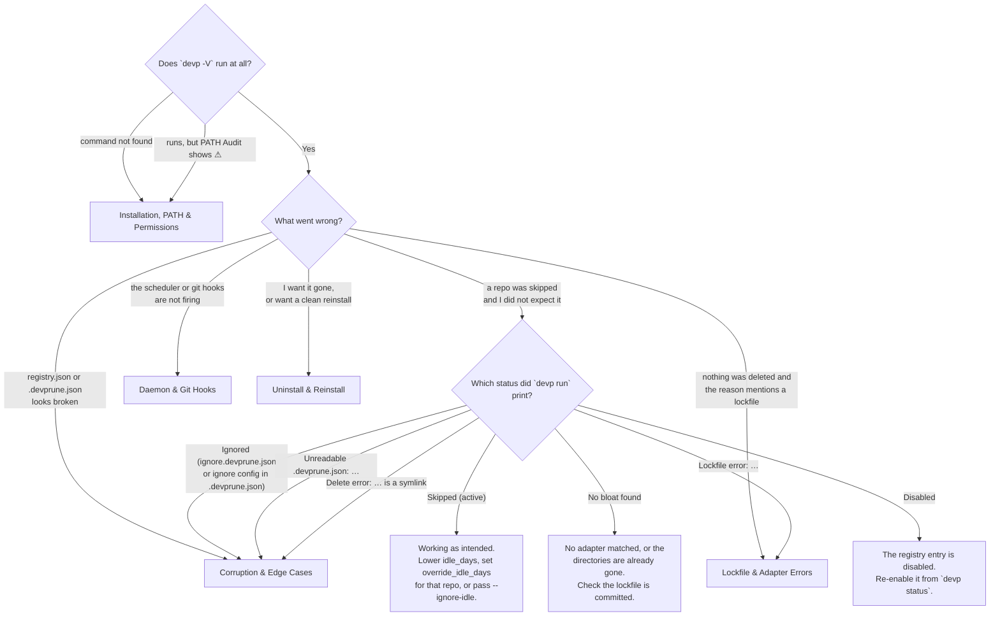

# 🛠️ `dev-prune` Comprehensive Troubleshooting Index & Synopsis

Welcome to the exhaustive Troubleshooting Directory for **`dev-prune`** (`devp`). This repository hub categorizes all potential installation, runtime, background automation, ecosystem lockfile, and uninstallation issues into structured diagnostic manuals.

---

## 🖼️ Visual Diagnostics Banner


---

## 🩺 Start Here: `devp doctor`

Before working through any of the guides below, run the diagnosis. It is read-only — it
runs no package manager and repairs nothing, so it is safe to run at any point and can be
run again to see whether a fix landed.

```bash
devp doctor
```

That checks the installation: the binary and whether its directory is on `PATH`, the
registry and every setting in it, the scheduler, hooks, `SKILL.md` and icon registration,
which package managers are actually reachable, and the release-check state. Give it a path
to ask about one repository instead — `devp doctor .` names the single reason a prune pass
would skip it, in the order the pass itself decides:

```bash
devp doctor .
```

Warnings exit `0`; only genuine breakage exits `1`. Whatever it flags maps onto one of the
guides below.

---

## 🧭 Which Guide Do You Need?



Every skip prints one of those statuses verbatim. If you saw no line for the repository
at all, it was never registered — run `devp link .` inside it.

---

## 🗂️ Categorized Troubleshooting Guides

### 1. 🚀 [Installation, PATH & Permission Issues](INSTALLATION_ISSUES.md)
Diagnoses binary placement errors, PATH environment variable setup, terminal shell profile reloads (`.zshrc`, `.bashrc`, PowerShell `$PROFILE`), `chmod +x` permission errors (`EACCES`), Windows Defender anti-virus false positives, and Current Working Directory (CWD) determinism checks.

### 2. 🔒 [Lockfile Sync & Ecosystem Adapter Errors](LOCKFILE_AND_ADAPTERS.md)
Detailed fix workflows for package manager lockfile sync failures (`npm`, `pnpm`, `yarn`, `bun`, `uv`, `venv`, `cargo`, `go`), missing ecosystem binaries, command timeout adjustments (`command_timeout_secs`), offline/network failures, and shell-specific fix snippets.

### 3. 🤖 [Background Daemon & Git Hook Subsystems](DAEMON_AND_HOOKS.md)
Troubleshooting OS background schedulers (Windows Task Scheduler `schtasks`, macOS LaunchAgent `plist`, Linux systemd user timers) and non-blocking Git background auto-registration hooks (`post-commit`, `post-checkout`, `post-merge`).

### 4. 🧹 [Uninstall, Reinstall & State Recovery](UNINSTALL_AND_REINSTALL.md)
Complete guide for standard uninstallation (`devp uninstall`), deep configuration wipes (`devp uninstall --deep`), manual residual directory cleanup, PATH restoration, clean reinstall passes, and state recovery using `devp undo`.

### 5. ⚠️ [State Corruption, Symlinks & Edge Cases](CORRUPTION_AND_EDGE_CASES.md)
Solutions for corrupted `registry.json` files, invalid `.devprune.json` syntax (which makes dev-prune skip the repository rather than guess), workspace directory renames, symlinked and junctioned bloat directories, network mounts, and running out of disk space during pruning passes.

---

## ⚡ Quick Diagnostics Command

```bash
devp doctor
```

`devp doctor .` diagnoses one repository. `devp -V` is the smaller, older check — version,
OS, config path, binary directory and PATH activation, and nothing else.
